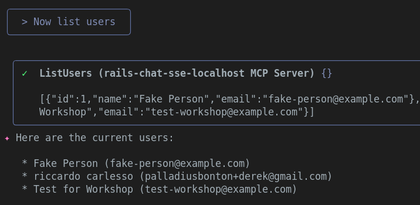
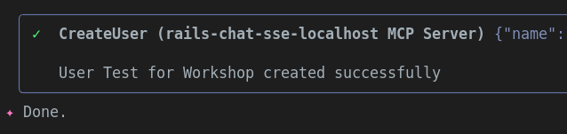

## Rails + MCP + Gemini Workshop v1.0.4a

<!-- Dies ist das Master-Dokument.
Verwenden Sie `just translate-workshop-to-italian`, um es ins ITALIENISCHE zu übersetzen

ÄNDERUNGSPROTOKOLL
01. Okt. 25 v1.0.4 [ricc] Version im H1-Titel hervorgehoben und TODOs am Ende entfernt, als Quests neu formuliert.
29. Sep. 25 v1.0.3 [ricc] Überschriften neu nummeriert, um bei 0 zu beginnen.
28. Sep. 29 v1.0.2 [ricc] Bessere Übersetzung, `git clone` NACH `gemini-cli` verschoben
28. Sep. 25 v1.0.1 [ricc] Nach `docs/workshop/` verschoben. GC-Abhängigkeit und einige schöne Screenshots hinzugefügt.
27. Sep. 25 v1.0.0 [ricc] ...
-->

🇮🇹 Eine italienische Version ist [hier](WORKSHOP-it.md) verfügbar 🇮🇹

**TL;DR** In diesem Workshop werden wir:

1.  Gemini CLI herunterladen
2.  Die App herunterladen und anfangen, Gemini einige Fragen zu stellen.
3.  Die Standard-App ohne jegliche Magie ausführen. Einige Funktionen werden noch nicht verfügbar sein.
4.  GCP-Credits erhalten, einen 🔑 GEMINI API KEY abrufen und ihn in `.env` eintragen
5.  Die App neu starten und die Magie testen. Jetzt funktioniert der Chat und erstellt tolle Bilder!
6.  Jetzt fangen wir an, mit MCP zu spielen und konfigurieren Gemini CLI so, dass es sich mit Ihrer Rails-App MCP verbindet! Jetzt können Sie in natürlicher Sprache mit Ihrer App sprechen!
7.  Ihre eigene MCP-Funktion erstellen und sie von Gemini CLI aus testen!

**Hinweis**. Der Workshop ist mit 🧙‍♂️ Quests 🧙‍♂️ durchsetzt. Wenn Sie die Quest in einem physischen Workshop lösen, sagen Sie es Ihren Mentoren! Wenn Sie schnell sind, erhalten Sie möglicherweise ein Geschenk.
**Hinweis**. Dieser Workshop wurde für das **Devfest Modena** erstellt. Möglicherweise fehlen Ihnen Informationen, wenn Sie nicht an diesem Workshop teilnehmen.

## 0. Voraussetzungen

*   Ein **GMail**-Konto haben. Dies wird benötigt, um GCP-Credits zu beanspruchen und die Nutzung von Gemini LLM zu ermöglichen!
*   `ruby` lokal installiert. Wir empfehlen einen Versionsmanager wie `rbenv`, `rvm`, `asdf` oder was auch immer für Sie funktioniert.
*   [optional] Ein **GitHub**-Konto. Dies wird nur benötigt, wenn Sie das Repo forken möchten, für fortgeschrittene Benutzer.
*   [optional] [just](https://github.com/casey/just) installieren. Ohne dieses Tool schauen Sie sich einfach die Rezepte in `justfile` an.

### Code installieren/herunterladen

1.  `git clone https://github.com/palladius/rails8-turbo-chat.git`
2.  `cp .env.dist .env`: Sie werden es später brauchen.

Merken Sie sich den 📂 ORDNER, in dem Sie sich befinden, Sie müssen `gemini` aus genau diesem Ordner starten.

------

## 1. Gemini CLI installieren (und Informationen über die App erhalten)

<!-- **Warum**. Es ist wahrscheinlich einfacher, wenn Benutzer Gemini CLI von Anfang an nutzen können. Sie können fragen
1. Was die App tut
2. Worum es im letzten Commit ging, und so weiter.
-->

Um Gemini CLI zu **installieren**, verwenden Sie einen der folgenden Befehle:

```bash
# Mit npx (keine Installation erforderlich)
npx https://github.com/google-gemini/gemini-cli
# Global mit `npm` installieren
npm install -g @google/gemini-cli
# Global mit Homebrew (macOS/Linux) installieren
brew install gemini-cli
```

Weitere Installationsoptionen [hier](https://github.com/google-gemini/gemini-cli).

Um Gemini CLI zu **starten**:

1.  Wechseln Sie in den Rails-App-Ordner 📂, den Sie zuvor heruntergeladen haben: `cd pfad/zu/rails8-turbo-chat/`
2.  Geben Sie einfach Folgendes ein: `gemini` und folgen Sie dem Google-Authentifizierungsablauf.

Lassen Sie uns nun Gemini CLI für eine sofortige Befriedigung verwenden:

1.  **Worum geht es in der App?**
    1.  `gemini -p "Erklären Sie die Architektur dieser Codebasis. Erzählen Sie mir von den Rails-Modellen und wie sie miteinander interagieren"`
2.  **Welche letzten Änderungen gab es im Repo?** Dies ist eine leistungsstarke Aufforderung, um sich über die Änderungen Ihrer Kollegen auf dem Laufenden zu halten (oder eine Zusammenfassung einer Änderung, die Sie letzte Nacht vorgenommen haben!)

```bash
$ gemini
## Kopieren Sie diese 4 Zeilen und fügen Sie sie in Gemini CLI ein!
Geben Sie mir eine Zusammenfassung aller Änderungen, die heute/gestern eingegangen sind, im Markdown-Modus.
Wenn in den letzten 2 Tagen keine Änderungen vorgenommen wurden, nehmen Sie stattdessen die letzten 3 Commits.
Schauen Sie sich git diff an und sehen Sie, welche Änderungen eingeführt wurden und warum. Ein Aufzählungspunkt pro Commit-Hash, bitte.
Legen Sie diese Ausgabe in `out/git-summary.md` ab
```


3.  **Was ist der Programmierstil von Riccardo oder Christian?**. Sie können auch menschenähnliche Fragen stellen!

```bash
$ gemini
Überprüfen Sie die letzten 3 Commits von:
- Christian
- Emiliano
- Riccardo
Schauen Sie sich den Code in git diff an und geben Sie zwei Informationen pro Person an:
1. Welchen Programmierstil sie haben
2. Welche Art von Code sie tendenziell bearbeiten (Frontend, Backend, GCP, Docs, ..)
Legen Sie diese Ausgabe in `out/people-style-summary.md` ab
```

Beispielantworten finden Sie in `docs/workshop/examples/` :)

------

## 2. Sofortige Befriedigung

<!-- **Warum**. In diesem Schritt geht es darum, den Benutzer mit so wenig Aufwand wie möglich glücklich und engagiert zu machen.
-->

In diesem Schritt installieren Sie die App und bringen sie zum Laufen

1.  `cd rubyllm_chat_app/`
2.  Ruby und Bundler installieren
3.  `bundle install` ausführen
4.  `bundle exec rails db:setup` ausführen
5.  [ricc] `bundle exec rails server`, um den Server auf Port 8080 zu starten
6.  Navigieren Sie mit Ihrem Browser zu http://localhost:8080/ . Sie sollten eine Seite wie die folgende sehen:
    
7.  Klicken Sie auf "Sign up" und fügen Sie hinzu:
    1.  Ihre **E-Mail**, **Name**, **Passwort** und wiederholen Sie es in **Passwortbestätigung**
    2.  Lassen Sie den *Gemini API Key* leer (er wird jetzt nicht benötigt).
    
8.  Sie sind fertig! Zeit, Ihren ersten Chat zu erstellen
    
9.  Klicken Sie auf "Start New Chat".
    1.  Oh oh - das ist kaputt! Wir benötigen einen Gemini API Key.

TODO(Christian): `rails s` und DB-Einrichtung.

**Hinweis**. Dies sollte mit allem außer den Bildern und dem Chat funktionieren, also sollten wir vielleicht eine Art DB-Generierung (`rake db:seed` ?) verwenden, um einen gefälschten Chat zu generieren. Dies ist eine gute Möglichkeit, die funktionierende App zu zeigen, ohne den API-Schlüssel einrichten zu müssen - noch nicht: kleine Schritte.

------

## 3. Gemini API Key erhalten und Bilder erstellen!

### 3a. GCP-Credits beanspruchen..

<!-- **Warum**. In diesem Schritt wird der Benutzer zwei Dinge tun:
    1. Cloud-Credits abrufen, um Gemini zu verwenden (langweilig), aber auch
    2. Diese Credits verwenden
-->

*   Rufen Sie Credits ab, indem Sie hier klicken: https://trygcp.dev/e/devfest-maudna-25 und sich mit Ihrem *persönlichen* Google-Konto anmelden.
*   Folgen Sie dem Link, um `5$` in Credits zu erhalten. Sie werden für den Workshop ausreichen.
*   Gehen Sie zu https://aistudio.google.com/apikey und generieren Sie einen GEMINI API KEY. Notieren Sie ihn lokal in Ihrer `.env` unter `GEMINI_API_KEY`
*   Wenn Sie verwirrt sind, sehen Sie sich diese [Schritt-für-Schritt-Folien](https://docs.google.com/presentation/d/1mY0BwcZERAqilVh4BaQfuX-RyayXrC4N2Pno4tzWcig/edit?) an, die das Team für Sie erstellt hat.

### 3b. .. und Gemini FTW verwenden!

Nachdem Sie den langweiligen Teil erledigt haben, sind Sie bereit, Ihre ersten Bilder zu generieren?

*   Überprüfen Sie zunächst, ob Gemini in der App funktioniert. Der einfachste Weg ist, `just test-gemini` aufzurufen
*   Starten Sie die App neu.
*   Stellen Sie sicher, dass der Gemini API Key funktioniert
    *   Vielleicht sicherstellen, dass ein fehlender API-Schlüssel oben eine sichtbare Warnung auslöst?
    *   Wenn Sie den Fehler sehen können, bedeutet das, dass Sie etwas falsch gemacht haben. Wenn der Fehler verschwunden ist, sind Sie startklar!
    
*   Erstellen Sie einen neuen Chat.
*   Stellen Sie eine Frage...
    *   Beobachten Sie die Magie: Ein Bild wird generiert und eine Zusammenfassung des Chats wird ebenfalls generiert
    *   TODO ricc: Screenshot vorher
    *   TODO ricc: Screenshot nachher

### 3c Bildgenerierung ändern

🧙‍♂️ **Quest** 🧙‍♂️ Ist Ihnen aufgefallen, dass alle Bilder mit einem gelben Herzen und einem Rubin herauskommen? Sieht so aus, als gäbe es im Code ein Osterei.

*   Finden Sie den Teil des Codes, in dem diese 2 "Filigrane" (oder "Wasserzeichen") zum Bild hinzugefügt werden
*   Ändern Sie es in etwas Lokales für Ihre Geografie, z. B. (für Modena, um das Gesicht von Pavarotti einzuschließen).
*   Testen Sie die neue Generation (möglicherweise durch Neuladen der App)
*   Zeigen Sie es einem Prüfer, um Ihren Preis zu erhalten.

------

## 4. Vorhandenes MCP testen

<!--
Hier zeigen wir, dass wir bereits vorgefertigte MCP haben
-->

1.  Lassen Sie uns mit `npx @modelcontextprotocol/inspector` Fehler beheben
2.  Klicken Sie auf den Link von der CLI (beachten Sie den MCP_PROXY_AUTH_TOKEN!), so etwas wie: `http://localhost:6274/?MCP_PROXY_AUTH_TOKEN=blahblahblah`
3.  Einrichten:
    1.  Transporttyp: **SSE**
    2.  URL: `http://localhost:8080/mcp/sse` - TODO(Christian), mi confermi usiamo 8080? o 3000?
4.  Klicken Sie auf **connect**.
5.  Wenn es funktioniert, klicken Sie auf **Tools**
6.  Klicken Sie auf List Tools.
7.  Sie sollten Folgendes sehen: 
8.  Klicken Sie auf ein Werkzeug, um es auszuführen, zum Beispiel `Chat List`. Genießen Sie eine Ausgabe wie diese! Beachten Sie, dass der MCP-Server hier ActiveRecord aufruft!


### 4.A - dasselbe in Ihrer IDE testen

Wenn Sie `vscode`, IntelliJ, Claude Code haben, können Sie jetzt MCP testen. Bitte überprüfen Sie Ihre Agentenkonfiguration, wie Sie den MCP hinzufügen.

#### Lokalen MCP zu Gemini CLI hinzufügen

*   Verwenden Sie `gemini mcp`, um unseren MCP dynamisch hinzuzufügen:
    *   `gemini mcp add --transport sse local-rails8-turbo-chat-sse http://localhost:8080/mcp/sse`
    *   Dadurch wird Gemini so konfiguriert, dass dieser MCP verfügbar ist.
*   **Starten** Sie `gemini` **neu** (doppeltes STRG-C). MCPs werden beim Start geladen, also nicht vergessen!
*   Geben Sie `/mcp` ein, um sicherzustellen, dass dies korrekt durchgeführt wurde. Sie sollten so etwas sehen:


Wenn Sie andere Tools verwenden (vscode, copilot, Claude Code), überprüfen Sie die Dokumentation zum Hinzufügen.
Normalerweise müssen Sie ein JSON wie dieses hinzufügen:

```json
{
  // ..Andere Optionen hier..
  "mcpServers": {
    // ..Andere MCP-Server hier..
    "rails-chat-sse-localhost": {
      "type": "sse",
      "url": "http://localhost:8080/mcp/sse"
    }
  }
}
```

Zu Ihrer lokalen Datei (z. B. `.vscode/settings.json` für Visual Studio Code).

Jetzt können Sie mit Gemini CLI (oder Copilot, Claude, ..) interagieren und mit Ihrer Anwendung mit Fragen wie diesen interagieren:

*   `Rufen Sie eine Liste von Chats ab: Gibt es einen Chat, der italienisches Essen enthält?`
*   `Fügen Sie einen Benutzer hinzu, der mit "test-workshop@example.com" und dem Passwort "PincoPallinoJoe" und dem Namen "Test for Workshop" erstellt wurde`
    
    
*   `Listen Sie jetzt die Benutzer auf` (was auch den neuen Benutzer anzeigen sollte)
    
*   Fragen Sie `Verwenden Sie MCP, um alle Chats automatisch umzubenennen`. Dies sollte die Chat-Titel für alle falsch benannten Chats magisch aktualisieren.

------

## 5. Eigenes MCP hinzufügen

**Ideen**. Ok, Zeit, selbst etwas zu programmieren! Sie können kreativ sein oder sich einige dieser Ideen holen:

*   `what_time_is_it`: Fügen Sie eine Funktion "Welches Datum / welche Uhrzeit ist es" hinzu.
*   `where_am_ai`: Rufen Sie eine externe API auf, um das lokale Wetter oder die nächstgelegene Stadt abzurufen.
*   *ActiveRecord-Magie*: Etwas ActiveRecord-Magie, um Beziehungen zu zählen und eine Statistik zu erstellen (wie viele Benutzer haben wie viele Chats erstellt).
*   TODO(Emiliano): irgendwelche Ideen, was wir hier hinzufügen können?

**Ausführung**.

Sie haben eine Idee, was Sie programmieren sollen? Großartig!

Jetzt:
1.  Fügen Sie Ihre Funktion zu `app/tools/` hinzu.
2.  Denken Sie daran, von `ActionTool::Base` zu erben. Weitere Details unter https://github.com/yjacquin/fast-mcp
3.  Sobald es funktioniert, laden Sie die `rails c` und testen Sie, ob der Code wie beabsichtigt funktioniert.
4.  Laden Sie dann die `rails s` neu; dies stellt sicher, dass Ihre App die neue Funktion hat!
5.  Jetzt ist es Zeit, es mit Ihren MCP-Tools zu testen! Verwenden Sie zuerst Gemini CLI (laden Sie dies auch neu) über `/mcp`, um zu überprüfen, ob die neue Funktion erschienen ist.
6.  Testen Sie die Funktion, indem Sie eine Frage in natürlicher Sprache stellen, die der Funktionsbeschreibung entspricht (z. B. "Wie spät ist es / Wo bin ich / ...").

------

## 6. [optional] Bilder auf GCS speichern 🧙‍♂️

OMG, Sie sind schneller hier angekommen, als wir es dokumentieren konnten! Zeit für eine Herausforderung!

🧙‍♂️ Lernen Sie, Ihr Bild auf Google Cloud Storage zu speichern. Offizielle Active Storage + GCS-Dokumente finden Sie [hier](https://guides.rubyonrails.org/active_storage_overview.html#google-cloud-storage-service).
<!--
Dies ist ein Game Changer, da ein Push in die Cloud Bilder über Computer und über lokal vs. remote hinweg beibehält. Aber es ist schwer einzurichten.
-->

## 7. [optional] `docker compose` ausprobieren

🧙‍♂️ Wussten Sie, dass Cloud Run jetzt `docker-compose` in Alpha unterstützt? 🧙‍♂️

Probieren Sie dies zuerst lokal aus:

```bash
cd rubyllm_chat_app/
docker-compose up
docker compose run web todo # TODO(Emiliano) ein Befehl wie rake db:seed oder ein anderer Test
```

Sobald Sie es zum Laufen gebracht haben, versuchen Sie dies in der Cloud:

```bash
gcloud alpha run compose --help
```

🧙‍♂️ Lassen Sie uns wissen, ob Sie es schaffen! 🧙‍♂️

<!-- TODO(Emiliano): dies vervollständigen -->

## 8. [optional] Mit `docker compose alpha` erstellen und in Cloud Run starten

<!-- sobald GCS konfiguriert ist, und vielleicht kann Emiliano helfen, ist der Rest ein Kinderspiel, zumindest für Riccardo
TODO(ricc/Emiliano)

-->

🧙‍♂️ Konfigurieren Sie Cloud Build und pushen Sie zu Cloud Run. 🧙‍♂️

Tipp: Eine funktionierende `cloudbuild.yaml` befindet sich im Basisordner und funktioniert für den Autor. Sie müssen nur ein paar Dinge anpassen und ändern. Etwas, bei dem Ihnen Gemini CLI helfen kann!
