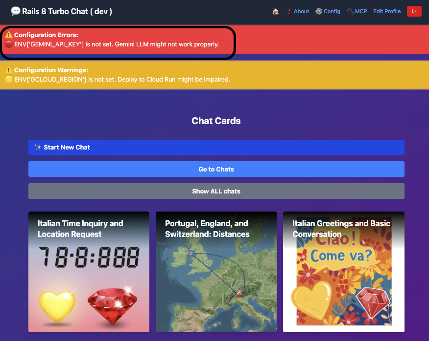

## Workshop: Rails + MCP + Gemini 🇮🇹

<!-- This is the master doc v1.0.1.
Use `just translate-workshop-to-italian` to translate to IT

CHANGELOG
28sep25 v1.0.1 [ricc] Moved to docs/workshop/ . Added GC dep, and some nice screenshots.
27sep25 v1.0.0 [ricc] ...
-->

🇬🇧 A English version is available [here](WORKSHOP.md) 🇬🇧

**🚀 In breve** In questo workshop vedremo come:

1.  Scaricare la Gemini CLI
2.  Scaricare l'app e iniziare a fare domande a Gemini.
3.  Eseguire l'app "vanilla", senza nessuna magia. Alcune funzionalità non saranno ancora disponibili.
4.  Ottenere crediti GCP, recuperare una 🔑 GEMINI API KEY e inserirla in `.env`
5.  Riavviare l'app e testare la magia. Ora la chat funziona e crea immagini fantastiche! 🖼️
6.  Ora iniziamo a giocare con MCP e configuriamo la Gemini CLI per connettersi all'MCP della tua app Rails! Ora puoi parlare con la tua app in linguaggio naturale! 🗣️
7.  Creare la tua funzione MCP e testarla dalla Gemini CLI! 🧑‍💻

**Nota**. Il workshop è intervallato da 🧙‍♂️ missioni 🧙‍♂️. Se risolvi la missione in un workshop fisico, dillo ai tuoi mentori! Se sei veloce, potresti ricevere un regalo. 🎁

## Prerequisiti

*   Avere un account GMail. Questo è necessario per richiedere i crediti GCP e per consentire l'uso di Gemini LLM!
*   [opzionale] Avere un account GitHub. Questo è necessario solo se si desidera "forkare" la repo, per utenti avanzati.
*   [opzionale] Installare [just](https://github.com/casey/just). Altrimenti, basta guardare le ricette in `justfile`.

## Installa/Scarica il codice

1.  `git clone https://github.com/palladius/rails8-turbo-chat.git`
2.  `cd rails8-turbo-chat/`
3.  `cp .env.dist .env`: ti servirà più tardi.

------

## Passo 0. Installa Gemini CLI (e ottieni informazioni sull'app)

<!-- **Why**. It's probably easier if users can leverage Gemini CLI from square 1. They can ask
1. What the app does
2. What was the last commit about, and so on.
-->

Per **installare** Gemini CLI, usa uno dei seguenti comandi:

```bash
# Usando npx (nessuna installazione richiesta)
npx https://github.com/google-gemini/gemini-cli
# Installa globalmente con `npm`
npm install -g @google/gemini-cli
# Installa globalmente con Homebrew (macOS/Linux)
brew install gemini-cli
```

Altre opzioni di installazione [qui](https://github.com/google-gemini/gemini-cli).

Per **avviare** Gemini CLI, digita semplicemente: `gemini` e segui il flusso di autenticazione di Google.

Usiamo ora Gemini CLI per una gratificazione immediata:

1.  **Di cosa parla l'app?**
    1.  `gemini -p "Spiega l'architettura di questa codebase. Parlami dei modelli Rails e di come interagiscono tra loro"`
2.  **Quali modifiche recenti sono state apportate alla repo?** Questo è un prompt potente per mettersi al passo con le modifiche dei colleghi (o un riepilogo di una modifica che hai fatto ieri sera!)

```bash
$ gemini
Dammi un riassunto di tutte le modifiche apportate oggi/ieri, in modalità markdown.
Se non ci sono modifiche negli ultimi 2 giorni, prendi invece gli ultimi 3 commit.
Dai un'occhiata a git diff e vedi quali modifiche sono state introdotte e perché. Un punto elenco per ogni hash di commit, per favore.
Salva questo output in `git-summary.md`
```

3.  **Qual è lo stile di codifica di Riccardo o Christian?**. Puoi anche fare domande di tipo umano!

```bash
$ gemini
Controlla gli ultimi 3 commit di:
- Christian
- Emiliano
- Riccardo
Dai un'occhiata al codice in git diff e fornisci due informazioni per persona:
1. Che stile di codifica hanno
2. Che tipo di codice tendono a modificare (frontend, backend, GCP, Docs, ..)
Salva questo output in `people-style-summary.md`
```

Trova le risposte di esempio in `docs/workshop/` :)
------

## Passo 1. Gratificazione immediata

<!-- **Why**. This step is about getting the user happy and engaged with as little effort as possible.
-->

In questo passaggio, installerai l'app e la farai funzionare

1.  `cd rubyllm_chat_app/`
2.  Installa ruby e bundler
3.  Esegui `bundle install`
4.  Esegui `bundle exec rails db:setup`
5.  [ricc] `bundle exec rails server` per eseguire il server sulla porta 8080
6.  Vai col tuo browser a http://localhost:8080/ . Dovresti vedere una pagina come quella qui sotto:
    
7.  Fai clic su "Sign up" e aggiungi:
    1.  La tua **Email**, **Nome**, **Password** e ripetila in **Conferma password**
    2.  Lascia vuoto il campo *Gemini API Key* (non è necessario ora).
    
8.  Fatto! È ora di creare la tua prima chat
    
9.  Fai clic su "Start New Chat".
    1.  oh oh - questo è rotto! Abbiamo bisogno di una Gemini API Key.

TODO(Christian): `rails s` e configurazione del DB.

**Nota**. Questo dovrebbe funzionare con tutto tranne le immagini e la chat, quindi forse dovremmo usare una sorta di generazione di DB (`rake db:seed`?) per generare una chat finta. Questo sarà un buon modo per mostrare l'app funzionante senza dover ancora configurare la chiave API: piccoli passi.

------

## Passo 2. Ottieni la Gemini API Key e inizia a creare immagini! 🖼️

### 2a. Richiedi i crediti GCP..

<!-- **Why**. In this step the user will do two things:
    1. retrieve Cloud credits to use Gemini (boring), but also
    2. Use those credits
-->

*   richiedi i crediti cliccando qui: https://trygcp.dev/e/devfest-maudna-25 accedendo con il tuo account Google *personale*.
*   Segui il link per ottenere `5$` di crediti. Saranno sufficienti per il workshop.
*   Vai su https://aistudio.google.com/apikey e genera una GEMINI API KEY. Annotala localmente nel tuo `.env`, sotto `GEMINI_API_KEY`

### 2b. .. e usa Gemini FTW!

Ora che hai fatto la parte noiosa, pronto a generare le tue prime immagini?

*   Per prima cosa, controlla che Gemini funzioni all'interno dell'app. Il modo più semplice è chiamare `just test-gemini`
*   riavvia l'app.
*   Assicurati che la Gemini API Key funzioni
    *   Forse assicurati che una chiave API mancante generi un avviso visibile in alto?
    *   Se riesci a vedere l'errore, significa che hai sbagliato qualcosa. Se l'errore è scomparso, sei a posto!
    
*   Crea una nuova chat.
*   Fai una domanda...
    *   Osserva la magia: viene generata un'immagine e viene generata anche una sinossi della chat
    *   TODO ricc: screenshot prima
    *   TODO ricc: screenshot dopo

### 2c cambia la generazione di immagini

🧙‍♂️ **Missione** 🧙‍♂️ Hai notato che tutte le immagini escono con un cuore giallo e un rubino? Sembra che ci possa essere un easter egg nel codice.

*   Trova la parte del codice in cui aggiunge queste 2 "filigrane" (o "watermark") all'immagine
*   Cambialo in qualcosa di locale alla tua geografia, ad esempio (per Modena, per includere il volto di Pavarotti).
*   Testa la nuova generazione (possibilmente ricaricando l'app)
*   Mostra a un supervisore per ottenere il tuo premio.

------

## Passo 3. Testa l'MCP esistente

<!--
Here we Show we have existing MCP already pre-built
-->

1.  Facciamo troubleshooting con `npx @modelcontextprotocol/inspector`
2.  Fai clic sul link dalla CLI (nota il MCP_PROXY_AUTH_TOKEN!), qualcosa come: `http://localhost:6274/?MCP_PROXY_AUTH_TOKEN=blahblahblah`
3.  Imposta:
    1.  Tipo di trasporto: **SSE**
    2.  URL: `http://localhost:8080/mcp/sse` - TODO(Christian), mi confermi usiamo 8080? o 3000?
4.  Fai clic su **connect**.
5.  Se funziona, fai clic su **Tools**
6.  Fai clic su List Tools.
7.  Dovresti vedere questo: 
8.  Fai clic su uno strumento da eseguire, ad esempio `Chat List`. Goditi un output come questo! Nota che il server MCP sta chiamando ActiveRecord qui!


### 3.A - testa lo stesso sul tuo IDE

Se hai `vscode`, IntelliJ, Claude Code, ora puoi testare MCP. Controlla la configurazione del tuo agente su come aggiungere l'MCP.

#### Aggiungi MCP locale a Gemini CLI

*   Usa `gemini mcp` per aggiungere dinamicamente il nostro MCP:
    *   `gemini mcp add --transport sse local-rails8-turbo-chat-sse http://localhost:8080/mcp/sse`
    *   Questo configurerà gemini per avere questo MCP disponibile.
*   **Riavvia** `gemini` (doppio CTRL-C). Gli MCP vengono caricati all'avvio, quindi non dimenticare!
*   Digita `/mcp` per assicurarti che sia stato fatto correttamente. Dovresti vedere qualcosa del genere:


Se stai usando altri strumenti (vscode, copilot, Claude Code), controlla la documentazione per aggiungerli.
Di solito è necessario aggiungere un JSON come questo:

```json
{
  // ..Altre opzioni qui..
  "mcpServers": {
    // ..Altri server MCP qui..
    "rails-chat-sse-localhost": {
      "type": "sse",
      "url": "http://localhost:8080/mcp/sse"
    }
  }
}
```

Al tuo file locale (ad es. `.vscode/settings.json` per Visual Studio code).

Ora puoi interagire con Gemini CLI (o Copilot, Claude, ..) e iniziare a interagire con la tua applicazione con domande come:

*   `Recupera un elenco di chat: qualche chat che contiene cibo italiano?`
*   `Aggiungi un utente creato "test-workshop@example.com" e password "PincoPallinoJoe" e nome "Test for Workshop"`
    
    
    *   `Ora elenca gli utenti` (che dovrebbe mostrare anche il nuovo utente)
    
*   Chiedi `Usa MCP per rinominare automaticamente tutte le chat`. Questo dovrebbe aggiornare magicamente i titoli delle chat per tutte le chat con nomi errati.

------

## Passo 4. Aggiungi il tuo MCP

**Idee**. Ok, è ora di programmare qualcosa da solo! Puoi essere creativo o prendere spunto da queste idee:

*   `che_ora_è`: Aggiungi una funzione "Che data/ora è".
*   `dove_sono`: Chiama un'API esterna per recuperare il meteo locale o la città più vicina.
*   *Magia di ActiveRecord*: Un po' di magia di ActiveRecord per contare le relazioni e fornire una statistica (quanti utenti hanno creato quante chat).
*   TODO(Emiliano): qualche idea su cosa possiamo aggiungere qui?

**Esecuzione**.

Hai un'idea di cosa programmare? Grande!

Ora:
1.  Aggiungi la tua funzione a `app/tools/`.
2.  Ricorda di sottoclassare da `ActionTool::Base`. Maggiori dettagli in https://github.com/yjacquin/fast-mcp
3.  Una volta che funziona, carica `rails c` e testa che il codice funzioni come previsto prima.
4.  Quindi, ricarica `rails s`; questo assicura che la tua app abbia la nuova funzione!
5.  Ora è il momento di testarlo con i tuoi strumenti MCP! Per prima cosa usa Gemini CLI (ricarica anche questo) tramite `/mcp` per verificare che la nuova funzione sia apparsa.
6.  Testa la funzione ponendo una domanda in linguaggio naturale che corrisponda alla descrizione della funzione (ad es. "Che ore sono / Dove sono / ...").

------

## Passo 6. [opzionale] Prova `docker compose` WIP

Prova questo:

```bash
cd rubyllm_chat_app/
docker-compose up
docker compose run web todo
```

## Passo 6. [opzionale] Rendi persistenti le immagini su GCS

<!--
This is a game changer, since a push to the cloud will persist images across computers and across local vs remote. But it's hard to setup.
-->

TODO(Emiliano)

## Passo 6. [opzionale] Compila e lancia su Cloud Run

<!-- once GCS is configured, and maybe Emiliano can help, the rest is a breeze, at least for Riccardo -->
TODO(ricc)