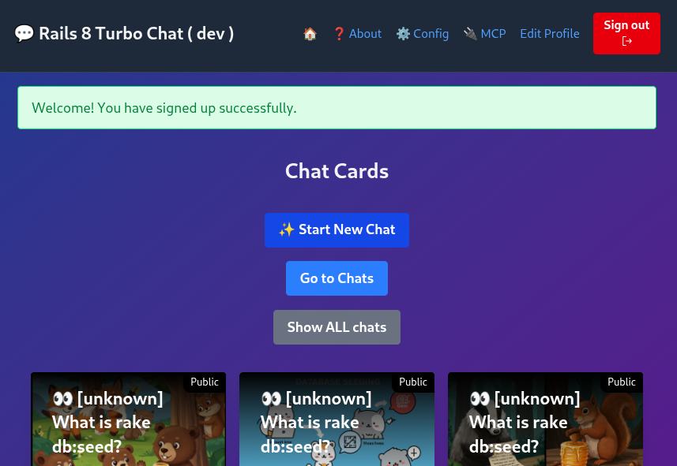

## Rails + MCP + Gemini Workshop v1.1.2

<!-- This is the master doc.
Use `just translate-workshop-to-italian` to translate to IT

CHANGELOG
01oct25 v1.1.2 [ricc] [Mac] fixed typos.
01oct25 v1.1.1 [ricc] Finalized ALL chapters. Seems good now.
01oct25 v1.1.0 [ricc] Changed a few images / retook screenshots, commented out some TODOs.
01oct25 v1.0.4 [ricc] Added 2 slide decks
01oct25 v1.0.4 [ricc] Surfaced version in H1 title, and removed TODOs from the end, rephrased as quests.
29sep25 v1.0.3 [ricc] Renumbered headings to start from 0.
28sep29 v1.0.2 [ricc] Better translation, moving git clone AFTER gemini-cli
28sep25 v1.0.1 [ricc] Moved to docs/workshop/ . Added GC dep, and some nice screenshots.
27sep25 v1.0.0 [ricc] ...
-->

🇮🇹 Una versione italiana è disponibile [qui](WORKSHOP-it.md) 🇮🇹 (e una tedesca [qui](WORKSHOP-de.md) 🇩🇪 )

**TL;DR** In questo workshop:

1. Installeremo Gemini CLI
2. Scaricheremo questa repo e inizieremo a fare domande a Gemini.
3. Eseguiremo l'app vanilla, senza alcuna magia. Alcune funzionalità non saranno ancora disponibili.
4. Otterremo crediti GCP, recupereremo una 🔑 `GEMINI API KEY` e la inseriremo in `.env`.
5. Riavvieremo l'app e testeremo la magia LLM. Ora la chat risponde in tempo reale e crea immagini fantasiose!
6. Ora iniziamo a giocare con MCP e configuriamo Gemini CLI per connettersi all'MCP della tua app Rails! Ora puoi parlare con la tua app in linguaggio naturale!
7. Creeremo la nostra funzione MCP e la testeremo da Gemini CLI!

**Nota**. Il workshop è intervallato da 🧙‍♂️ missioni 🧙‍♂️. Se risolvi la missione in un workshop fisico, dillo ai tuoi mentori! Se sei veloce, potresti ricevere un regalo.
**Nota**. Questo workshop è stato creato per il **Devfest Modena**. Potrebbero mancare informazioni se non sei un partecipante a questo workshop.

Materiale del workshop:

* 🟧 [**Slide del workshop**](https://docs.google.com/presentation/d/1W4hFU1eckLYMsdI20VyqcL-G1l11vxeeYsgBqfTMpMw/edit?slide=id.g387c805a455_1_446#slide=id.g387c805a455_1_446). Un mezzo diverso per seguire questo workshop. Nota che questa pagina è più precisa e dettagliata, mentre le slide offrono una visione sinottica di alto livello.
* 🟧 [**Slide per il riscatto dei crediti**](https://docs.google.com/presentation/d/1mY0BwcZERAqilVh4BaQfuX-RyayXrC4N2Pno4tzWcig/edit?slide=id.g337964b5ba0_1_193#slide=id.g337964b5ba0_1_193): qui trovi i link per ottenere crediti GCP. Ne avrai bisogno per il passaggio 3.

## 0. Prerequisiti

* Avere un account **GMail**. Questo è necessario per richiedere i crediti GCP e per consentire l'utilizzo di Gemini LLM!
* `ruby` installato localmente. Consigliamo un gestore di versioni come `rbenv`, `rvm`, `asdf` o qualsiasi cosa funzioni per te.
* [opzionale] Un account **GitHub**. Questo è necessario solo se si desidera eseguire il fork della repo, per utenti avanzati.
* [opzionale] Installa [just](https://github.com/casey/just). In caso contrario, basta guardare le ricette in `justfile`.

### Installa/Scarica il codice

1. `git clone https://github.com/palladius/rails8-turbo-chat.git`
2. `cp .env.dist .env`: ne avrai bisogno più tardi.

Ricorda la 📂 CARTELLA in cui ti trovi, dovrai avviare `gemini` da questa esatta cartella.

------

## 1. Installa Gemini CLI (e ottieni informazioni sull'app)

<!-- **Why**. It's probably easier if users can leverage Gemini CLI from square 1. They can ask
1. What the app does
2. What was the last commit about, and so on.
-->

Per **installare** Gemini CLI, usa uno dei seguenti comandi:

```bash
# Using npx (no installation required)
npx https://github.com/google-gemini/gemini-cli
# Install globally with `npm`
npm install -g @google/gemini-cli
# Install globally with Homebrew (macOS/Linux)
brew install gemini-cli
```

Altre opzioni di installazione [qui](https://github.com/google-gemini/gemini-cli).

Per **avviare** Gemini CLI:

1. Cambia directory nella cartella dell'app Rails 📂 che hai scaricato prima: `cd path/to/rails8-turbo-chat/`
2. Digita semplicemente: `gemini` e segui il flusso di autenticazione di Google.

Usiamo ora Gemini CLI per una gratificazione immediata:

1. **Di cosa tratta l'app?**
   1. `gemini -p "Spiega l'architettura di questa codebase. Parlami dei modelli Rails e di come interagiscono tra loro"`
   2. Ignora gli errori MCP.
2. **Quali modifiche recenti sono state apportate alla repo?** Questo è un prompt potente per recuperare le modifiche dei tuoi colleghi (o un riepilogo di una modifica che hai fatto ieri sera!)

```bash
$ gemini
## Copy these 4 lines and paste them onto Gemini CLI!
Give me a summary of all of the changes that went in today/yesterday, in markdown mode.
If no changes in past 2 days, take the last 3 commits instead.
Take a look at git diff and see what changes have been introduced and why. One bullet point per commit hash, please.
Dump this output in `out/git-summary.md`
```


3. **Qual è lo stile di codifica di Riccardo o Christian? Controlla i log di git e aggrega per committer**. Puoi anche fare domande di tipo umano, ovviamente!
   Questo richiederebbe a un essere umano probabilmente 4-5 ore per elaborare i dati.

<!--

```bash
$ gemini
Check the latest 3 commits from:
- Christian
- Emiliano
- Riccardo
Take a look at the code in git diff and provide two info per person:
1. What coding style they have
2. What kind of code they tend to edit (frontend, backend, GCP, Docs, ..)
Dump this output in `out/people-style-summary.md`
```

-->

Trova le risposte di esempio in `docs/workshop/examples/` :)

------

## 2. Gratificazione immediata

<!-- **Why**. This step is about getting the user happy and engaged with as little effort as possible.
-->

In questo passaggio, installerai l'app e la eseguirai

1. `cd rubyllm_chat_app/`
2. Installa ruby e bundler
3. Esegui `bundle install`
4. Esegui `bundle exec rails db:setup`
1. [ricc] `bundle exec rails server` per eseguire il server sulla porta 8080
1. Vai con il tuo browser a http://localhost:8080/ . Dovresti vedere una pagina come quella qui sotto:

1. Fai clic su "Registrati"
2. Fai clic su "Registrati" e aggiungi:
   1. La tua **Email**, **Nome**, **Password** e ripetila in **Conferma password**


1. Fatto! Ora possiamo creare la tua prima chat




2. Fai clic su "Inizia nuova chat".
   1. oh oh - questo è rotto! Abbiamo bisogno di una chiave API Gemini.


<!--
TODO(Christian): `rails s` and DB set up.
-->

**Nota**. Questo dovrebbe funzionare con tutto tranne le immagini e la chat, quindi forse dovremmo usare una sorta di generazione di DB (`rake db:seed`?) per generare una chat finta. Questo sarà un buon modo per mostrare l'app funzionante senza dover ancora configurare la chiave API: piccoli passi.


### 2B. Chiedi a Gemini CLI informazioni sul DB

```
Now find the dev sqlite file and show me the tables.
Show me all the schema and create a DATABASE_INFO.md which contains:
1. The schema you've found.
2. A Mermaid graph of all the tables and how they interconnect (foreign keys) in visual way.
Embed all in the markdown file. Color in red the tables matching the models in app/models/ and
in GRAY everything else.
```

Vedi una possibile risposta in `examples/DATABASE_INFO.md`


* Ora tocca a **te**! Puoi fare QUALSIASI domanda a Gemini CLI: puoi ottenere maggiori dettagli su quelle tabelle e confrontare i risultati dalla visualizzazione del DB nudo con le query ORM (come `echo Chat.last | rails console`)


------

## 3. Ottieni la chiave API di Gemini e inizia a creare immagini!

### 3a. Richiedi i crediti GCP..


<!-- **Why**. In this step the user will do two things:
    1. retrieve Cloud credits to use Gemini (boring), but also
    2. Use those credits
-->

* recupera i crediti facendo clic qui: https://trygcp.dev/e/devfest-maudna-25 accedendo con il tuo account Google *personale*.
* Segui il link per ottenere `5$` di crediti. Saranno sufficienti per il workshop.
* Vai su https://aistudio.google.com/apikey e genera una GEMINI API KEY. Annotala localmente nel tuo `.env`, sotto `GEMINI_API_KEY`
* Se sei confuso, controlla queste [slide passo-passo](https://docs.google.com/presentation/d/1mY0BwcZERAqilVh4BaQfuX-RyayXrC4N2Pno4tzWcig/edit?) che il team ha creato per te.

### 3b. .. e usa Gemini FTW!

Ora che hai fatto la parte noiosa, sei pronto a generare le tue prime immagini?

* Per prima cosa, controlla che Gemini funzioni all'interno dell'app. Il modo più semplice è chiamare `just test-gemini`
* riavvia l'app.
* Assicurati che la chiave API di Gemini funzioni
  * Forse assicurarsi che una chiave API mancante generi un avviso visibile in alto?
  * Se riesci a vedere l'errore, significa che hai sbagliato qualcosa. Se l'errore è scomparso, sei a posto!

* Crea una nuova chat.
* Fai una domanda...
  * Osserva la magia: viene generata un'immagine e viene generata anche una sinossi della chat
  * **Prima** (nota che non ho fatto lo screenshot in tempo e il titolo/descrizione erano già cambiati..)

  * ... e **dopo** 5 secondi!


### 3c cambia la generazione di immagini


🧙‍♂️ **Missione** 🧙‍♂️ Hai notato che tutte le immagini escono con un cuore giallo e un rubino? Sembra che ci possa essere un easter egg nel codice.

* Trova la parte del codice in cui aggiunge queste 2 'filigrane' (o 'watermark') all'immagine
* Cambialo in qualcosa di locale alla tua geografia, ad esempio (per Modena, per includere il volto di Pavarotti).
* Prova la nuova generazione (possibilmente ricaricando l'app)
* Mostra a un supervisore per ottenere il tuo premio.

------

## 4. Testa l'MCP esistente con l'MCP Inspector

<!--
Here we Show we have existing MCP already pre-built
-->

1. Risolviamo i problemi con `npx @modelcontextprotocol/inspector` (il miglior strumento di debug del client MCP a conoscenza dell'autore - segnala un problema se pensi che si sbagli).
2. Fai clic sul link dalla CLI (nota `MCP_PROXY_AUTH_TOKEN`!), qualcosa del tipo: `http://localhost:6274/?MCP_PROXY_AUTH_TOKEN=mys3cr3tt0k3n`
3. Imposta:
   1. Tipo di trasporto: **SSE**
   2. URL: `http://localhost:8080/mcp/sse`
4. Fai clic su **connetti**.
5. Se funziona, fai clic su **Strumenti**
6. Fai clic su Elenca strumenti.
7. Dovresti vedere questo: 
8. Fai clic su uno strumento da eseguire, ad esempio `Elenco chat`. Goditi un output come questo! Nota che il server MCP sta chiamando ActiveRecord here!


### 4.A - prova lo stesso sul tuo IDE

Se hai `vscode`, IntelliJ, Claude Code, ora puoi testare MCP. Controlla la configurazione del tuo agente su come aggiungere l'MCP.

#### Aggiungi MCP locale a Gemini CLI


* Usa `gemini mcp` per aggiungere il nostro MCP in modo dinamico:
  * `gemini mcp add --transport sse local-rails8-turbo-chat-sse http://localhost:8080/mcp/sse`
  * Questo configurerà gemini per avere questo MCP disponibile.
* **Riavvia** `gemini` (doppio CTRL-C). Gli MCP vengono caricati all'avvio, quindi non dimenticare!
* Digita `/mcp` per assicurarti che l'operazione sia stata eseguita correttamente. Dovresti vedere qualcosa di simile (nota il pulsante verde accanto al nome del server MCP):


Se stai usando altri strumenti (vscode, copilot, Claude Code), controlla la documentazione per aggiungerli.
Di solito è necessario aggiungere un JSON come questo:

```json
{
  // ..Other options here..
  "mcpServers": {
    // ..Other MCP servers here..
    "rails-chat-sse-localhost": {
      "type": "sse",
      "url": "http://localhost:8080/mcp/sse"
    }
  }
}
```

Al tuo file locale (ad es. `.vscode/settings.json` per Visual Studio Code).

Ora puoi interagire con Gemini CLI (o Copilot, Claude, ..) e iniziare a interagire con la tua applicazione con domande come:

*  `Recupera un elenco di chat: qualche chat che contiene cibo italiano?`
*  `Aggiungi un utente creato "test-workshop@example.com" e password "PincoPallinoJoe" e nome "Test per Workshop"`


   *  `Ora elenca gli utenti` (che dovrebbe anche far apparire il nuovo utente)

* Chiedi `Usa MCP per rinominare automaticamente tutte le chat`. Questo dovrebbe aggiornare magicamente i titoli delle chat per tutte le chat con nomi errati.

------

## 5. Aggiungi il tuo MCP

**Idee**. Ok, è ora di programmare qualcosa da solo! Puoi essere creativo o prendere spunto da queste idee:

* `what_time_is_it`: Aggiungi una funzione "Che data/ora è".
* `where_am_ai`: Chiama un'API esterna per recuperare il meteo locale o la città più vicina.
* *Magia di ActiveRecord*: un po' di magia di ActiveRecord per contare le relazioni e fornire una statistica (quanti utenti hanno creato quante chat).
  * Forse qualcosa che funzioni bene anche con ActiveStorage? Forse qualcosa che aiuti a risolvere i problemi e a risolvere [questo problema](https://github.com/palladius/rails8-turbo-chat/issues/24)?

<!--
* TODO(Emiliano): any ideas what we can add here?
 -->

**Esecuzione**.

Hai un'idea di cosa programmare? Fantastico!


Ora:
1. Aggiungi la tua funzione a `app/tools/` ([cartella](https://github.com/palladius/rails8-turbo-chat/tree/main/rubyllm_chat_app/app/tools)).
2. Ricorda di sottoclassare da `ActionTool::Base`. Maggiori dettagli in https://github.com/yjacquin/fast-mcp
3. Una volta che funziona, carica `rails c` e verifica prima che il codice funzioni come previsto.
4. Quindi, ricarica `rails s`; questo assicura che la tua app abbia la nuova funzione!
5. Ora è il momento di testarlo con i tuoi strumenti MCP! Per prima cosa usa Gemini CLI (ricarica anche questo) tramite `/mcp` per verificare che la nuova funzionalità sia apparsa.
6. Testa la funzione ponendo una domanda in linguaggio naturale che corrisponda alla descrizione della funzione (ad es. "Che ore sono / Dove sono / ...").


------


## 6. [opzionale] Rendi persistenti le immagini su GCS 🧙‍♂️

OMG, sei arrivato qui più velocemente di quanto potessimo documentarlo! È ora di una sfida!

🧙‍♂️ Impara a rendere persistente la tua immagine su Google Cloud Storage. La documentazione ufficiale di Active Storage + GCS è [qui](https://guides.rubyonrails.org/active_storage_overview.html#google-cloud-storage-service).
<!--
This is a game changer, since a push to the cloud will persist images across computers and across local vs remote. But it's hard to setup.
-->


## 7. [opzionale] Prova `docker compose`

🧙‍♂️  Sapevi che Cloud Run ora supporta docker-compose in alpha? 🧙‍♂️

Per prima cosa, prova questo localmente:

```bash
cd rubyllm_chat_app/
docker-compose up
docker compose run web todo # TODO(Emiliano) some command like rake db:seed or some different test
```

In secondo luogo, una volta che funziona, prova questo nel cloud:

```bash
gcloud alpha run compose --help
```

🧙‍♂️ Facci sapere se ce la fai! 🧙‍♂️


<!-- TODO(Emiliano): complete this -->

Suggerimento: Riccardo ha creato una versione funzionante qui: https://github.com/palladius/rails8-composer-sample/blob/main/README.md segui le briciole di pane del collegamento simbolico per la soluzione.

Suggerimento: il documento della guida per l'utente alfa è [qui](https://docs.google.com/document/d/1UJrkn6wnzoHTQjenERhKfvOWPUahBydaWUNF-84B4c8/view?resourcekey=0-qixytbA9n5irnaH3QDyL6g&tab=t.0#heading=h.74iuc6663cso).

## 8. [opzionale] Crea e avvia su Cloud Run tramite `docker compose alpha`

<!-- once GCS is configured, and maybe Emiliano can help, the rest is a breeze, at least for Riccardo
TODO(ricc/Emiliano) -->

🧙‍♂️  Configura Cloud Build e invia a Cloud Run.  🧙‍♂️

L'idea è di creare una pipeline CI/CD funzionante in modo che ogni successivo commit/push nella TUA repo.

1. Esegui il fork di questa repo su https://github.com/TUO_NOME_UTENTE/rails8-turbo-chat/
2. Adatta `cloudbuild.yaml` con il tuo ID progetto e i tuoi parametri.
3. Imposta un ServiceAccount per esso. Controlla `iac/` per chicche e codice precotto!

Suggerimento: un `cloudbuild.yaml` funzionante si trova nella cartella di base e funziona per l'autore. Lo stesso vale per `iac/` per tutta la configurazione di GCP! Devi solo modificare e cambiare alcune cose. Qualcosa in cui Gemini CLI può aiutarti!
