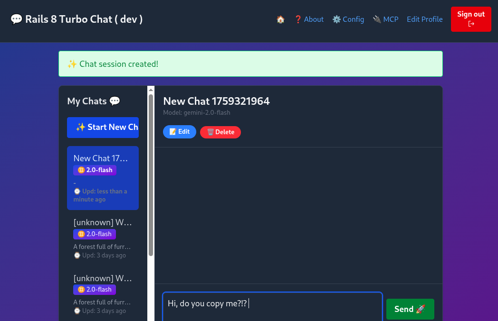
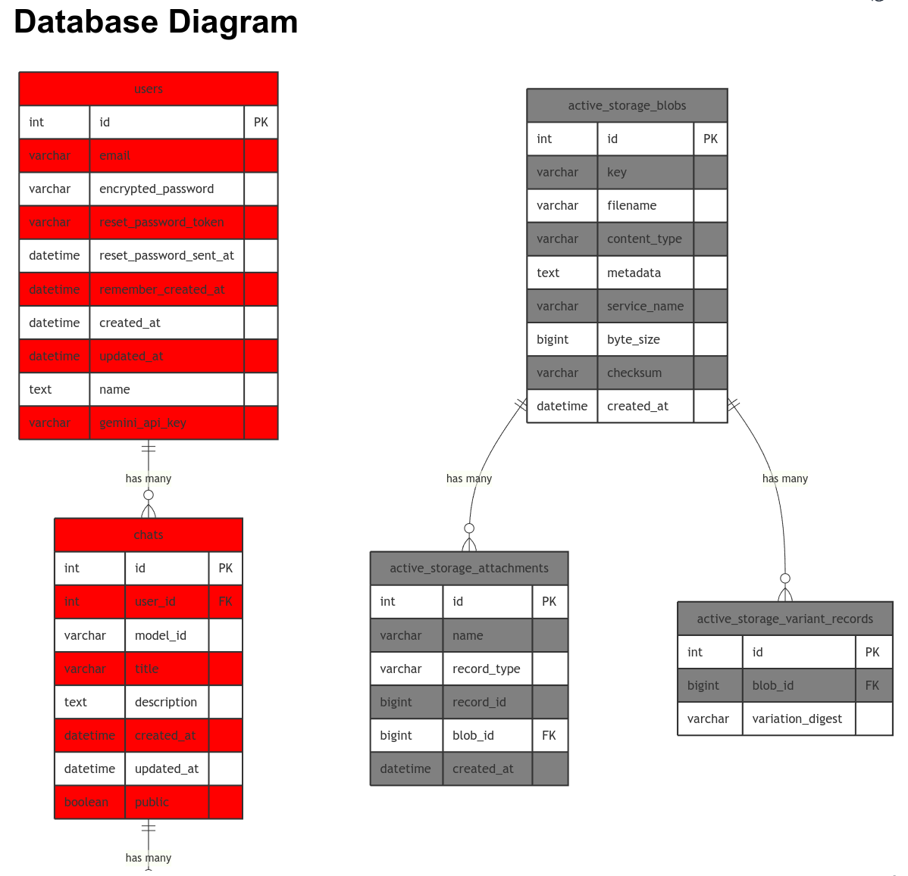
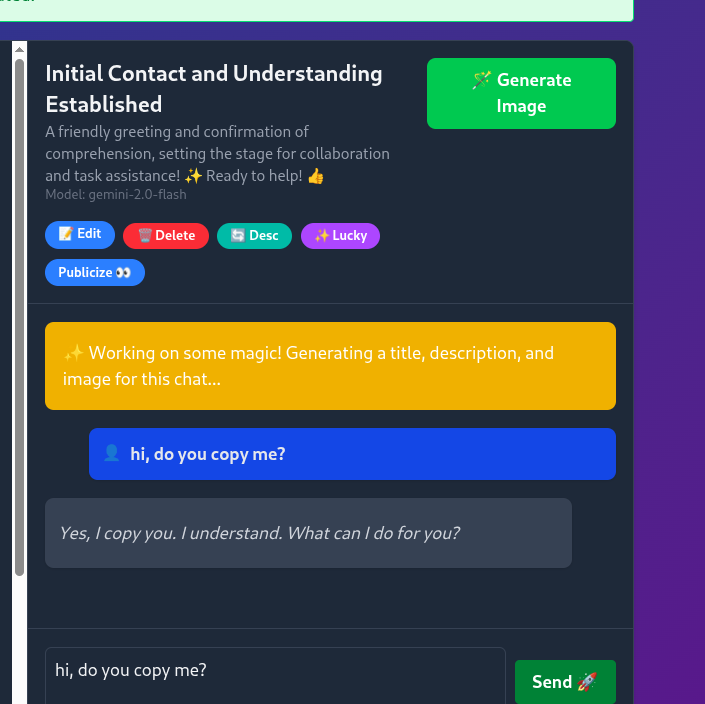
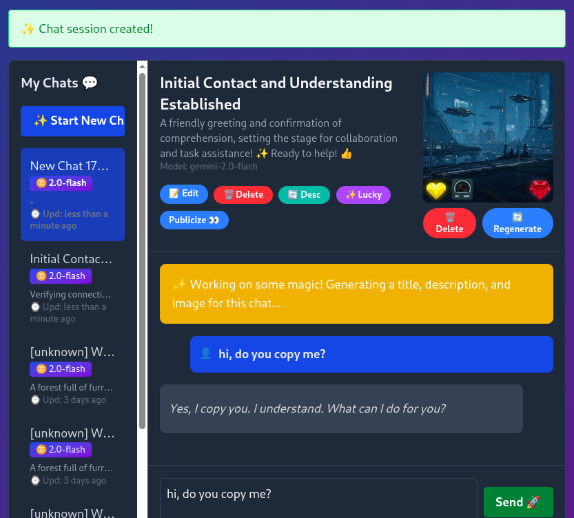

## Workshop Rails + MCP + Gemini v1.1.3

<!-- Questo è il documento principale.
Usa `just translate-workshop-to-italian` per tradurre in IT

CHANGELOG
02ott25 v1.1.3 [ricc] [Mac] Ultime modifiche dopo Emiliano 8080->3000->8080
01ott25 v1.1.2 [ricc] [Mac] Corretti errori di battitura.
01ott25 v1.1.1 [ricc] Finalizzati TUTTI i capitoli. Sembra buono ora.
01ott25 v1.1.0 [ricc] Cambiate alcune immagini / rifatti screenshot, commentati alcuni TODO.
01ott25 v1.0.4 [ricc] Aggiunti 2 set di slide
01ott25 v1.0.4 [ricc] Versione in titolo H1, e rimossi i TODO dalla fine, riformulati come quest.
29set25 v1.0.3 [ricc] Rinnumerati i titoli per iniziare da 0.
28set29 v1.0.2 [ricc] Migliore traduzione, spostando git clone DOPO gemini-cli
28set25 v1.0.1 [ricc] Spostato in docs/workshop/. Aggiunta dipendenza GC e alcuni bei screenshot.
27set25 v1.0.0 [ricc] ...
-->

🇮🇹 Una versione italiana è disponibile [qui](WORKSHOP-it.md) 🇮🇹 (e una tedesca [qui](WORKSHOP-de.md) 🇩🇪 )

**TL;DR** In questo workshop faremo:

1. Installare Gemini CLI
2. Scaricare questo repository e iniziare a fare domande a Gemini.
3. Eseguire l'app vanilla, senza alcuna magia. Alcune funzionalità non saranno ancora disponibili.
4. Ottenere crediti GCP, recuperare una 🔑 `GEMINI API KEY` e inserirla in `.env`.
5. Riavviare l'app e testare la magia LLM. Ora la Chat risponde in tempo reale e crea immagini fantasiose!
6. Ora iniziamo a giocare con MCP e configuriamo Gemini CLI per connettersi al tuo MCP dell'app Rails! Ora puoi parlare con la tua app in linguaggio naturale!
7. Crea la tua funzione MCP e testala da Gemini CLI!

**Nota**. Il workshop è intervallato da 🧙‍♂️ quest 🧙‍♂️. Se risolvi la quest in un workshop fisico, dillo ai tuoi mentori! Se sei veloce, potresti ricevere un regalo.
**Nota**. Questo workshop è stato creato per **Devfest Modena**. Potrebbero mancarti informazioni se non sei un partecipante a questo workshop.

Materiale del workshop:

* 🟧 [**Slide del Workshop**](https://docs.google.com/presentation/d/1W4hFU1eckLYMsdI20VyqcL-G1l11vxeeYsgBqfTMpMw/edit?slide=id.g387c805a455_1_446#slide=id.g387c805a455_1_446). Un mezzo diverso per seguire questo workshop. Nota che questa pagina è più precisa e dettagliata, mentre le slide offrono una visione sinottica di alto livello.
* 🟧 [**Slide per il riscatto dei crediti**](https://docs.google.com/presentation/d/1mY0BwcZERAqilVh4BaQfuX-RyayXrC4N2Pno4tzWcig/edit?slide=id.g337964b5ba0_1_193#slide=id.g337964b5ba0_1_193): qui trovi i link per ottenere i crediti GCP. Ne avrai bisogno per il passaggio 3.

## 0. Prerequisiti

* Avere un account **GMail**. Questo è necessario per riscattare i crediti GCP e per consentire l'utilizzo di Gemini LLM!
* `ruby` installato localmente. Consigliamo un gestore di versioni come `rbenv`, `rvm`, `asdf` o qualsiasi cosa funzioni per te.
* [opzionale] Un file `docker-compose.yml` è disponibile se riscontri problemi con ruby
* [opzionale] Un account **GitHub**. Questo è necessario solo se vuoi fare il fork del repository, per utenti avanzati.
* [opzionale] Installa [just](https://github.com/casey/just). Senza di esso, basta guardare le ricette in `justfile`.

### Installa/Scarica il codice

1. `git clone https://github.com/palladius/rails8-turbo-chat.git`
2. `cp .env.dist .env`: ti servirà più tardi.

Ricorda la 📂 CARTELLA in cui ti trovi, dovrai avviare `gemini` da questa esatta cartella.

------

## 1. Installa Gemini CLI (e ottieni informazioni sull'app)

<!-- **Perché**. È probabilmente più facile se gli utenti possono sfruttare Gemini CLI fin dall'inizio. Possono chiedere
1. Cosa fa l'app
2. Qual è stato l'ultimo commit, e così via.
-->

Per **installare** Gemini CLI, usa uno dei seguenti comandi:

```bash
# Usando npx (nessuna installazione richiesta)
npx https://github.com/google-gemini/gemini-cli
# Installa globalmente con `npm`
npm install -g @google/gemini-cli
# Installa globalmente con Homebrew (macOS/Linux)
brew install gemini-cli
```

Altre opzioni di installazione [qui](https://github.com/google-gemini/gemini-cli).

Per **avviare** Gemini CLI:

1. Cambia directory nella cartella dell'app Rails 📂 che hai scaricato prima: `cd path/to/rails8-turbo-chat/`
2. Digita semplicemente: `gemini` e segui il flusso di autenticazione di Google.

Ora usiamo Gemini CLI per una gratificazione istantanea:

1. **Di cosa tratta l'app?**
   1. `gemini -p "Spiega l'architettura di questa codebase. Parlami dei modelli Rails e di come interagiscono tra loro"`
   2. Ignora gli errori MCP.
2. **Quali modifiche recenti sono avvenute nel repository?** Questo è un prompt potente per aggiornarsi rapidamente sulle modifiche dei colleghi (o un riepilogo di una modifica che hai fatto la scorsa notte!)

```bash
$ gemini
## Copia queste 4 righe e incollale su Gemini CLI!
Dammi un riepilogo di tutte le modifiche avvenute oggi/ieri, in modalità markdown.
Se non ci sono modifiche negli ultimi 2 giorni, prendi gli ultimi 3 commit.
Dai un'occhiata a git diff e vedi quali modifiche sono state introdotte e perché. Un punto elenco per ogni hash di commit, per favore.
Salva questo output in `out/git-summary.md`
```


3. **Qual è lo stile di codifica di Riccardo o Christian? Controlla i log di git e aggrega per committer**. Puoi fare anche domande più umane, ovviamente!
   Ci vorrebbero probabilmente 4-5 ore a un essere umano per elaborare questi dati.

<!--

```bash
$ gemini
Controlla gli ultimi 3 commit da:
- Christian
- Emiliano
- Riccardo
Dai un'occhiata al codice in git diff e fornisci due informazioni per persona:
1. Che stile di codifica hanno
2. Che tipo di codice tendono a modificare (frontend, backend, GCP, Docs, ..)
Salva questo output in `out/people-style-summary.md`
```

-->

Trova esempi di risposte in `docs/workshop/examples/` :)

------

## 2. Gratificazione istantanea

<!-- **Perché**. Questo passaggio serve a rendere l'utente felice e coinvolto con il minimo sforzo possibile.
-->

In questo passaggio, installi l'app e la fai funzionare

1. `cd rubyllm_chat_app/`
2. Installa ruby e bundler
3. Esegui `bundle install`
4. Esegui `./bin/rails db:setup`
5. Esegui `./bin/rails assets:precompile`
6. Esegui `export PORT=8080` per impostare la variabile d'ambiente 'PORT' a 8080
7. [ricc] `bundle exec rails server` per avviare il server sulla porta 8080
8. Naviga con il browser su http://localhost:8080/. Dovresti vedere una pagina come quella sotto:

9. Clicca su "Sign up"
10. Inserisci la tua **Email**, **Nome**, **Password** e ripetila in **Conferma Password**


11. Hai finito! Ora possiamo creare la tua prima chat


12. Clicca su "Start New Chat".
    1. oh oh - questo è rotto! Abbiamo bisogno di una Gemini API Key.



### 2B. Chiedi a Gemini CLI informazioni sul DB

```
Ora trova il file sqlite di sviluppo e mostrami le tabelle.
Mostrami tutto lo schema e crea un DATABASE_INFO.md che contenga:
1. Lo schema che hai trovato.
2. Un grafico Mermaid di tutte le tabelle e di come si interconnettono (chiavi esterne) in modo visivo.
Incorpora tutto nel file markdown. Colora in rosso le tabelle che corrispondono ai modelli in app/models/ e
in GRIGIO tutto il resto.
```

Vedi una possibile risposta in `examples/DATABASE_INFO.md`



* Ora è il **tuo** turno! Puoi fare QUALSIASI domanda a Gemini CLI - puoi ottenere maggiori dettagli su quelle tabelle e confrontare i risultati dalla vista DB nuda con le query ORM (come `echo Chat.last | rails console`)


------

## 3. Ottieni la Gemini API Key e inizia a creare immagini!

### 3a. Riscatta i crediti GCP..


<!-- **Perché**. In questo passaggio l'utente farà due cose:
    1. recuperare i crediti Cloud per usare Gemini (noioso), ma anche
    2. Usare quei crediti
-->

* Recupera i crediti andando su https://trygcp.dev/e/devfest-maudna-25 accedendo con il tuo account Google *personale*.
* Segui il link per ottenere `5$` in crediti. Saranno sufficienti per il workshop.
* Vai su https://aistudio.google.com/apikey e genera una GEMINI API KEY creando un nuovo progetto chiamato `rails8-turbo-chat`
* Annotalo localmente nel tuo `.env`, sotto `GEMINI_API_KEY`
* Visita https://console.cloud.google.com naviga su Fatturazione > Account collegato e seleziona l'unico account disponibile che dovrebbe essere `Google Cloud Platform Trial Billing Account`


* Se sei confuso, controlla queste [slide passo-passo](https://docs.google.com/presentation/d/1mY0BwcZERAqilVh4BaQfuX-RyayXrC4N2Pno4tzWcig/edit?) che il team ha creato per te.

### 3b. .. e usa Gemini FTW!

Ora che hai fatto la parte noiosa, pronto a generare le tue prime immagini?

* Per prima cosa, controlla che Gemini funzioni all'interno dell'app. Il modo più semplice è chiamare `just test-gemini`
* Riavvia l'app.
* Assicurati che la Gemini API Key funzioni. Se vedi l'errore, significa che hai fatto qualcosa di sbagliato. Se l'errore è scomparso, sei a posto!

* Crea una nuova chat.
* Fai una domanda...
  * Osserva la magia: viene generata un'immagine e viene generato anche un riassunto della chat
  * **Prima** (nota che non ho fatto lo screenshot in tempo e titolo/descrizione erano già cambiati..)

  * ... e **dopo** 5 secondi!


### 3c cambia generazione di immagini


🧙‍♂️ **Quest** 🧙‍♂️ Hai notato che tutte le immagini escono con un cuore giallo e un rubino? Sembra che ci possa essere un easter egg nel codice.

* Trova la parte del codice in cui aggiunge queste 2 "filigrane" (o "watermark") all'immagine
* Cambiala con qualcosa di locale alla tua geografia, ad esempio (per Modena, per includere il volto di Pavarotti).
* Testa la nuova generazione (possibilmente ricaricando l'app)
* Mostra a un proctor per ottenere il tuo premio.

------

## 4. Testa l'MCP esistente con MCP Inspector

<!--
Qui mostriamo che abbiamo già MCP pre-costruiti
-->

1. Risolviamo i problemi con `npx @modelcontextprotocol/inspector` (il miglior strumento di debug client MCP a conoscenza dell'autore - segnala un problema se pensi che si sbagli).
2. Clicca sul link dalla CLI (nota il `MCP_PROXY_AUTH_TOKEN`!), qualcosa come: `http://localhost:6274/?MCP_PROXY_AUTH_TOKEN=mys3cr3tt0k3n`
3. Configura:
   1. Tipo di trasporto: **SSE**
   2. URL: `http://localhost:8080/mcp/sse`
4. Clicca **connetti**.
5. Se funziona, clicca su **Strumenti**
6. Clicca su Elenca Strumenti.
7. Dovresti vedere questo: 
8. Clicca su uno strumento da eseguire, ad esempio `Chat List`. Goditi un output come questo! Nota che il server MCP sta chiamando ActiveRecord qui!


### 4.A - testa lo stesso sul tuo IDE

Se hai `vscode`, IntelliJ, Claude Code, ora puoi testare MCP. Controlla la configurazione del tuo agente su come aggiungere l'MCP.

#### Aggiungi MCP locale a Gemini CLI


* Usa `gemini mcp` per aggiungere il nostro MCP dinamicamente:
  * `gemini mcp add --transport sse local-rails8-turbo-chat-sse http://localhost:8080/mcp/sse`
  * Questo configurerà gemini per avere questo MCP disponibile.
* **Riavvia** `gemini` (doppio CTRL-C). Gli MCP vengono caricati all'avvio, quindi non dimenticare!
* Digita `/mcp` per assicurarti che sia stato fatto correttamente. Dovresti vedere qualcosa del genere (nota il pulsante verde accanto al nome del server MCP):


Se stai usando altri strumenti (vscode, copilot, Claude Code), controlla la documentazione per aggiungerli.
Di solito devi aggiungere un JSON come questo:

```json
{
  // ..Altre opzioni qui..
  "mcpServers": {
    // ..Altri server MCP qui..
    "rails-chat-sse-localhost": {
      "type": "sse",
      "url": "http://localhost:8080/mcp/sse"
    }
  }
}
```

Al tuo file locale (ad esempio `.vscode/settings.json` per Visual Studio Code).

Ora puoi interagire con Gemini CLI (o Copilot, Claude, ..) e iniziare a interagire con la tua applicazione con domande come:

* `Recupera un elenco di chat: Qualche chat contenente cibo italiano?`
* `Aggiungi un utente creato "test-workshop@example.com" e password "PincoPallinoJoe" e nome "Test per Workshop"`


   * `Ora elenca gli utenti` (che dovrebbe anche mostrare il nuovo utente)

* Chiedi `Usa MCP per rinominare automaticamente tutte le chat`. Questo dovrebbe aggiornare magicamente i titoli delle chat per tutte le chat nominate erroneamente.

------

## 5. Aggiungi il tuo MCP

**Idee**. Ok, è ora di programmare qualcosa da solo! Puoi essere creativo, o prendere alcune di queste idee:

* `what_time_is_it`: Aggiungi una funzione "Che data/ora è".
* `where_am_i`: Chiama un'API esterna per recuperare il meteo locale o la città più vicina.
* *Magia di ActiveRecord*: Qualche magia di ActiveRecord per contare le relazioni e fornire statistiche (quanti utenti hanno creato quante chat).
  * Magari qualcosa che funzioni bene anche con ActiveStorage? Magari qualcosa che aiuti a risolvere e correggere [questo problema](https://github.com/palladius/rails8-turbo-chat/issues/24)?

<!--
* TODO(Emiliano): qualche idea su cosa possiamo aggiungere qui?
 -->

**Esecuzione**.

Hai un'idea di cosa programmare? Ottimo!


Ora:
1. Aggiungi la tua funzione a `app/tools/` ([cartella](https://github.com/palladius/rails8-turbo-chat/tree/main/rubyllm_chat_app/app/tools)).
2. Ricorda di sottoclassare da `ActionTool::Base`. Maggiori dettagli in https://github.com/yjacquin/fast-mcp
3. Una volta che funziona, carica `rails c` e testa che il codice funzioni come previsto.
4. Quindi, ricarica `rails s`; questo assicura che la tua app abbia la nuova funzione!
5. Ora è il momento di testarla con i tuoi strumenti MCP! Per prima cosa usa Gemini CLI (ricarica anche questo) tramite `/mcp` per controllare che la nuova funzionalità sia apparsa.
6. Testa la funzione ponendo una domanda in linguaggio naturale che corrisponda alla descrizione della funzione (ad esempio "Che ora è / Dove sono / ...").


------


## 6. [opzionale] Persisti le immagini su GCS 🧙‍♂️

OMG, sei arrivato qui più velocemente di quanto potessimo documentarlo! È ora di una sfida!

🧙‍♂️ Impara a persistere la tua immagine su Google Cloud Storage. La documentazione ufficiale di Active Storage + GCS è [qui](https://guides.rubyonrails.org/active_storage_overview.html#google-cloud-storage-service).
<!--
Questo cambia le carte in tavola, poiché un push al cloud persisterà le immagini su diversi computer e tra locale e remoto. Ma è difficile da configurare.
-->


## 7. [opzionale] Prova `docker compose`

🧙‍♂️ Sapevi che Cloud Run ora supporta docker-compose in alpha? 🧙‍♂️

Per prima cosa, prova questo localmente:

```bash
cd rubyllm_chat_app/
docker-compose up
# TODO(Emiliano) qualche comando come rake db:seed o qualche test diverso
#docker compose run web some-docker-compose-init-command
```

Secondo, una volta che funziona, prova questo nel Cloud:

```bash
gcloud alpha run compose --help
```

🧙‍♂️ Facci sapere se ci riesci! 🧙‍♂️


<!-- TODO(Emiliano): completa questo -->

Suggerimento: Riccardo ha creato una versione funzionante qui: https://github.com/palladius/rails8-composer-sample/blob/main/README.md segui le briciole di pane del symlink fino alla soluzione.

Suggerimento: il documento Alpha User Guide è [qui](https://docs.google.com/document/d/1UJrkn6wnzoHTQjenERhKfvOWPUahBydaWUNF-84B4c8/view?resourcekey=0-qixytbA9n5irnaH3QDyL6g&tab=t.0#heading=h.74iuc6663cso).

## 8. [opzionale] Costruisci e lancia su Cloud Run tramite `docker compose alpha`

<!-- una volta configurato GCS, e forse Emiliano può aiutare, il resto è un gioco da ragazzi, almeno per Riccardo
TODO(ricc/Emiliano) -->

🧙‍♂️ Configura Cloud Build e fai il push su Cloud Run. 🧙‍♂️

L'idea è di costruire una pipeline CI/CD funzionante per ogni commit/push successivo al TUO repository.

1. Fai il fork di questo repository su https://github.com/YOUR_USER_NAME/rails8-turbo-chat/
2. Adatta `cloudbuild.yaml` con il tuo ID progetto e i tuoi parametri.
3. Configura ServiceAccount per esso. Controlla `iac/` per chicche e codice pre-cotto!

Suggerimento: un `cloudbuild.yaml` funzionante si trova nella cartella base e funziona per l'autore. Lo stesso vale per `iac/` per tutta la configurazione GCP! Devi solo modificare e cambiare alcune cose. Qualcosa con cui Gemini CLI può aiutarti!