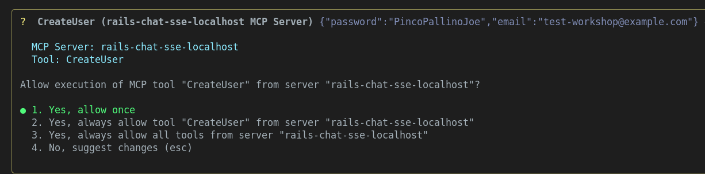

## Rails + MCP + Gemini Workshop

<!-- This is the master doc.
Use `just translate-workshop-to-italian` to translate to IT

CHANGELOG
29sep25 v1.0.3 [ricc] Renumbered headings to start from 0.
28sep29 v1.0.2 [ricc] Better translation, moving git clone AFTER gemini-cli
28sep25 v1.0.1 [ricc] Moved to docs/workshop/ . Added GC dep, and some nice screenshots.
27sep25 v1.0.0 [ricc] ...
-->

🇬🇧 La versione inglese è disponibile [qui](WORKSHOP.md) 🇬🇧

**TL;DR** In questo workshop:

1. Scaricheremo la Gemini CLI
2. Scaricheremo l'app e inizieremo a fare qualche domanda a Gemini.
3. Eseguiremo l'app vanilla, senza alcuna magia. Alcune funzionalità non saranno ancora disponibili.
4. Otterremo crediti GCP, recupereremo una 🔑 GEMINI API KEY e la inseriremo in `.env`
5. Riavvieremo l'app e testeremo la magia. Ora la chat funziona e crea immagini fantastiche!
6. Ora iniziamo a giocare con MCP e configuriamo la Gemini CLI per connettersi all'MCP della tua app Rails! Ora puoi parlare con la tua app in linguaggio naturale!
7. Creeremo la tua funzione MCP e la testeremo dalla Gemini CLI!

**Nota**. Il workshop è intervallato da 🧙‍♂️ missioni 🧙‍♂️. Se risolvi la missione in un workshop fisico, dillo ai tuoi mentori! Se sei veloce, potresti ricevere un regalo.
**Nota**. Questo workshop è stato creato per il **Devfest Modena**. Potrebbero mancare informazioni se non sei un partecipante a questo workshop.

## 0. Prerequisiti

* Avere un account **GMail**. Questo è necessario per richiedere i crediti GCP e per consentire l'utilizzo di Gemini LLM!
* `ruby` installato localmente. Raccomandiamo un gestore di versioni come `rbenv`, `rvm`, `asdf` o qualsiasi cosa funzioni per te.
* [opzionale] Un account **GitHub**. Questo è necessario solo se si desidera effettuare un fork del repository, per utenti avanzati.
* [opzionale] Installare [just](https://github.com/casey/just). Senza di esso, basta guardare le ricette in `justfile`.

### Installa/Scarica il codice

1. `git clone https://github.com/palladius/rails8-turbo-chat.git`
2. `cp .env.dist .env`: ti servirà più tardi.

Ricorda la 📂 CARTELLA in cui ti trovi, dovrai avviare `gemini` da questa esatta cartella.

------

## 1. Installa Gemini CLI (e ottieni informazioni sull'app)

<!-- **Why**. It's probably easier if users can leverage Gemini CLI from square 1. They can ask
1. What the app does
2. What was the last commit about, and so on.
-->

Per **installare** Gemini CLI, utilizza uno dei seguenti comandi:

```bash
# Usando npx (nessuna installazione richiesta)
npx https://github.com/google-gemini/gemini-cli
# Installa globalmente con `npm`
npm install -g @google/gemini-cli
# Installa globalmente con Homebrew (macOS/Linux)
brew install gemini-cli
```

Altre opzioni di installazione [qui](https://github.com/google-gemini/gemini-cli).

Per **avviare** Gemini CLI:

1. Cambia directory nella cartella dell'app Rails 📂 che hai scaricato prima: `cd path/to/rails8-turbo-chat/`
2. Digita semplicemente: `gemini` e segui il flusso di autenticazione di Google.

Usiamo ora Gemini CLI per una gratificazione immediata:

1. **Di cosa tratta l'app?**
   1. `gemini -p "Spiega l'architettura di questa codebase. Parlami dei modelli Rails e di come interagiscono tra loro"`
2. **Quali modifiche recenti sono state apportate al repository?** Questo è un prompt potente per aggiornarsi sulle modifiche dei colleghi (o un riepilogo di una modifica che hai fatto ieri sera!)

```bash
$ gemini
## Copia queste 4 righe e incollale nella Gemini CLI!
Dammi un riassunto di tutte le modifiche apportate oggi/ieri, in modalità markdown.
Se non ci sono modifiche negli ultimi 2 giorni, prendi invece gli ultimi 3 commit.
Dai un'occhiata a git diff e vedi quali modifiche sono state introdotte e perché. Un punto elenco per hash di commit, per favore.
Salva questo output in `out/git-summary.md`
```


3. **Qual è lo stile di codifica di Riccardo o Christian?**. Puoi anche fare domande di tipo umano!

```bash
$ gemini
Controlla gli ultimi 3 commit di:
- Christian
- Emiliano
- Riccardo
Dai un'occhiata al codice in git diff e fornisci due informazioni per persona:
1. Che stile di codifica hanno
2. Che tipo di codice tendono a modificare (frontend, backend, GCP, Docs, ..)
Salva questo output in `out/people-style-summary.md`
```

Trova le risposte di esempio in `docs/workshop/examples/` :)

------

## 2. Gratificazione immediata

<!-- **Why**. This step is about getting the user happy and engaged with as little effort as possible.
-->

In questo passaggio, installerai l'app e la farai funzionare

1. `cd rubyllm_chat_app/`
2. Installa ruby e bundler
3. Esegui `bundle install`
4. Esegui `bundle exec rails db:setup`
1. [ricc] `bundle exec rails server` per eseguire il server sulla porta 8080
1. Naviga nel tuo browser su http://localhost:8080/ . Dovresti vedere una pagina come quella qui sotto:

1. Fai clic su "Sign up" e aggiungi:
   1. La tua **Email**, **Nome**, **Password** e ripetila in **Conferma password**
   2. Lascia vuota la *Chiave API Gemini* (non è necessaria ora).

1. Hai finito! È ora di creare la tua prima chat

1. Fai clic su "Start New Chat".
   1. oh oh - questo è rotto! Abbiamo bisogno di una chiave API Gemini.

TODO(Christian): `rails s` e configurazione del DB.


**Nota**. Questo dovrebbe funzionare con tutto tranne le immagini e la chat, quindi forse dovremmo usare una sorta di generazione di DB (`rake db:seed`?) per generare una chat finta. Questo sarà un buon modo per mostrare l'app funzionante senza dover ancora configurare la chiave API: piccoli passi.

------

## 3. Ottieni la chiave API di Gemini e inizia a creare immagini!

### 3a. Richiedi i crediti GCP..


<!-- **Why**. In this step the user will do two things:
    1. retrieve Cloud credits to use Gemini (boring), but also
    2. Use those credits
-->

* recupera i crediti cliccando qui: https://trygcp.dev/e/devfest-maudna-25 accedendo con il tuo account Google *personale*.
* Segui il link per ottenere `5$` di crediti. Saranno sufficienti per il workshop.
* Vai su https://aistudio.google.com/apikey e genera una GEMINI API KEY. Annotala localmente nel tuo `.env`, sotto `GEMINI_API_KEY`
* Se sei confuso, controlla queste [diapositive passo-passo](https://docs.google.com/presentation/d/1mY0BwcZERAqilVh4BaQfuX-RyayXrC4N2Pno4tzWcig/edit?) che il team ha creato per te.

### 3b. .. e usa Gemini FTW!

Ora che hai fatto la parte noiosa, pronto a generare le tue prime immagini?

* Per prima cosa, controlla che Gemini funzioni all'interno dell'app. Il modo più semplice è chiamare `just test-gemini`
* riavvia l'app.
* Assicurati che la chiave API di Gemini funzioni
  * Forse assicurati che una chiave API mancante generi un avviso visibile in alto?
  * Se riesci a vedere l'errore, significa che hai sbagliato qualcosa. Se l'errore è scomparso, sei a posto!

* Crea una nuova chat.
* Fai una domanda...
  * Osserva la magia: viene generata un'immagine e viene generata anche una sinossi della chat
  * TODO ricc: screenshot prima
  * TODO ricc: screenshot dopo

### 3c cambia la generazione di immagini


🧙‍♂️ **Missione** 🧙‍♂️ Hai notato che tutte le immagini escono con un cuore giallo e un rubino? Sembra che ci possa essere un easter egg nel codice.

* Trova la parte del codice in cui aggiunge queste 2 "filigrane" (o "watermark") all'immagine
* Cambialo in qualcosa di locale alla tua geografia, ad esempio (per Modena, per includere il volto di Pavarotti).
* Prova la nuova generazione (possibilmente ricaricando l'app)
* Mostra a un supervisore per ottenere il tuo premio.

------

## 4. Testa l'MCP esistente

<!--
Here we Show we have existing MCP already pre-built
-->

1. Risolviamo i problemi con `npx @modelcontextprotocol/inspector`
2. Fai clic sul link dalla CLI (nota il MCP_PROXY_AUTH_TOKEN!), qualcosa come: `http://localhost:6274/?MCP_PROXY_AUTH_TOKEN=blahblahblah`
3. Imposta:
   1. Tipo di trasporto: **SSE**
   2. URL: `http://localhost:8080/mcp/sse` - TODO(Christian), mi confermi usiamo 8080? o 3000?
4. Fai clic su **connetti**.
5. Se funziona, fai clic su **Strumenti**
6. Fai clic su Elenca strumenti.
7. Dovresti vedere questo: 
8. Fai clic su uno strumento per eseguirlo, ad esempio `Elenco chat`. Goditi un output come questo! Nota che il server MCP sta chiamando ActiveRecord qui!


### 4.A - prova lo stesso sul tuo IDE

Se hai `vscode`, IntelliJ, Claude Code, ora puoi testare MCP. Controlla la configurazione del tuo agente su come aggiungere l'MCP.

#### Aggiungi MCP locale a Gemini CLI


* Usa `gemini mcp` per aggiungere dinamicamente il nostro MCP:
  * `gemini mcp add --transport sse local-rails8-turbo-chat-sse http://localhost:8080/mcp/sse`
  * Questo configurerà gemini per avere questo MCP disponibile.
* **Riavvia** `gemini` (doppio CTRL-C). Gli MCP vengono caricati all'avvio, quindi non dimenticare!
* Digita `/mcp` per assicurarti che ciò sia stato fatto correttamente. Dovresti vedere qualcosa di simile:


Se stai usando altri strumenti (vscode, copilot, Claude Code), controlla la documentazione per aggiungerli.
Di solito è necessario aggiungere un JSON come questo:

```json
{
  // ..Altre opzioni qui..
  "mcpServers": {
    // ..Altri server MCP qui..
    "rails-chat-sse-localhost": {
      "type": "sse",
      "url": "http://localhost:8080/mcp/sse"
    }
  }
}
```

Al tuo file locale (ad es. `.vscode/settings.json` per Visual Studio code).

Ora puoi interagire con Gemini CLI (o Copilot, Claude, ..) e iniziare a interagire con la tua applicazione con domande come:

*  `Recupera un elenco di chat: qualche chat contenente cibo italiano?`
*  `Aggiungi un utente creato "test-workshop@example.com" e password "PincoPallinoJoe" e nome "Test for Workshop"`


   *  `Ora elenca gli utenti` (che dovrebbe anche far apparire il nuovo utente)

* Chiedi `Usa MCP per rinominare automaticamente tutte le chat`. Questo dovrebbe aggiornare magicamente i titoli delle chat per tutte le chat con nomi errati.

------

## 5. Aggiungi il tuo MCP

**Idee**. Ok, è ora di programmare qualcosa da solo! Puoi essere creativo o prendere spunto da queste idee:

* `what_time_is_it`: Aggiungi una funzione "Che data/ora è".
* `where_am_ai`: Chiama un'API esterna per recuperare il meteo locale o la città più vicina.
* *Magia di ActiveRecord*: Un po' di magia di ActiveRecord per contare le relazioni e fornire una statistica (quanti utenti hanno creato quante chat).
* TODO(Emiliano): qualche idea su cosa possiamo aggiungere qui?

**Esecuzione**.

Hai un'idea di cosa programmare? Fantastico!

Ora:
1. Aggiungi la tua funzione a `app/tools/`.
2. Ricorda di sottoclassare da `ActionTool::Base`. Maggiori dettagli in https://github.com/yjacquin/fast-mcp
3. Una volta che funziona, carica `rails c` e verifica che il codice funzioni come previsto prima.
3. Quindi, ricarica `rails s`; questo assicura che la tua app abbia la nuova funzione!
4. Ora è il momento di testarlo con i tuoi strumenti MCP! Per prima cosa usa Gemini CLI (ricarica anche questo) tramite `/mcp` per verificare che la nuova funzionalità sia apparsa.
5. Prova la funzione ponendo una domanda in linguaggio naturale che corrisponda alla descrizione della funzione (ad es. "Che ore sono / Dove sono / ...").


------


## 6. [opzionale] Rendi persistenti le immagini su GCS TODO(Emiliano)

<!--
This is a game changer, since a push to the cloud will persist images across computers and across local vs remote. But it's hard to setup.
-->


## 7. [opzionale] Prova `docker compose` WIP TODO(Emiliano)

Prova questo:

```bash
cd rubyllm_chat_app/
docker-compose up
docker compose run web todo # TODO(Emiliano) some command like rake db:seed or some different test
```


TODO(Emiliano)

## 8. [opzionale] Compila e avvia su Cloud Run tramite `docker compose alpha`

<!-- once GCS is configured, and maybe Emiliano can help, the rest is a breeze, at least for Riccardo -->                                                                              │
TODO(ricc/Emiliano)