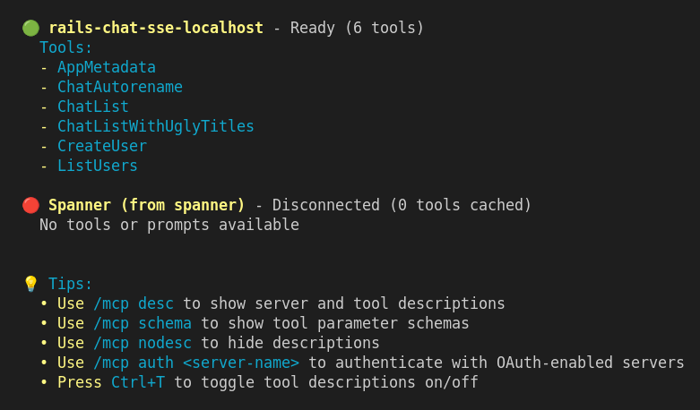
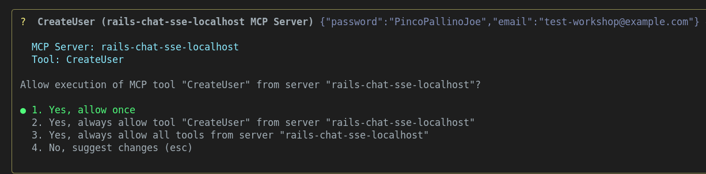
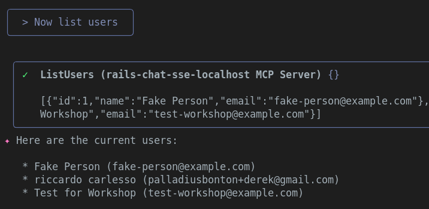
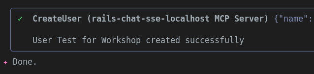

## Rails + MCP + Gemini Workshop

<!-- This is the master doc v1.0.1.
Use `just translate-workshop-to-italian` to translate to IT

CHANGELOG
28sep25 v1.0.1 [ricc] Moved to docs/workshop/ . Added GC dep, and some nice screenshots.
27sep25 v1.0.0 [ricc] ...
-->

🇮🇹 An Italian version is available [here](WORKSHOP-it.md) 🇮🇹

**TL;DR** In this workshop we will:

1. Download Gemini CLI
2. Download the app, and start asking Gemini some questions.
3. Run the vanilla app, without any magic. Some functionality won't be available yet.
4. Get GCP Credits, fetch a [key emoji] GEMINI API KEY, and put it in `.env`
5. Restart the app, and test the magic. Now the Chat works, and creates fancy images!
6. Now let's start playing with MCP, and configure Gemini CLI to connect to your Rails app MCP! Now you can talk to your app in natural language!
7. Create your own MCP function, and test it from Gemini CLI!

**Note**. The workshop is disseminated with 🧙‍♂️ quests 🧙‍♂️. If you solve the quest in a physical workshop, tell your mentors! If yo're fast, you might receive a present.

## Prerequisites

* Have GMail account. This is needed to reclaim GCP credits, and to allow Gemini LLM to be used!
* [optional] Have GitHub account. This is needed only if you want to fork the repo, for advanced users.
* [optional] Install `just`. Without it, just look at recipes in `justfile`.

## Install/Download the code


1. `git clone https://github.com:palladius/rails8-turbo-chat/`
2. `cd rails8-turbo-chat/`
3. `cp .env.dist .env`: you'll need it later.

------

## Step 0. Install Gemini CLI (and get intel on the app)

<!-- **Why**. It's probably easiuer if users can leverage Gemini CLI from square 1. They can ask
1. What the app does
2. What was the last commit about, and so on.
-->

To **install** Gemini CLI, use either of the following commands:

```bash
# Using npx (no installation required)
npx https://github.com/google-gemini/gemini-cli
# Install globally with `npm`
npm install -g @google/gemini-cli
# Install globally with Homebrew (macOS/Linux)
brew install gemini-cli
```

More install options [here].(https://github.com/google-gemini/gemini-cli)

To **start** Gemini CLI, just type this: `gemini` and follow the Google authentication flow.

Let's now use Gemini CLI for some instant gratification:

1. **What is the app about?**
   1. `gemini -p "Explain the architecture of this codebase. Tell me about the Rails models and how they interact with each other"`
2. **What recent changes happened to the repo?**. This is a powerful prompt to just catch up with your colleagues changes (or a recap from a change you did last night!)

```bash
$ gemini
Give me a summary of all of the changes that went in today/yesterday, in markdown mode.
If no changes in past 2 days, take the last 3 commits instead.
Take a look at git diff and see what changes have been introduced and why. One bullet point per commit hash, please.
Dump this output in `git-summary.md`
```

3. **What is the coding style of Riccardo or Christian?**. You can ask also human-like questions!

```bash
$ gemini
Check the latest 3 commits from:
- Christian
- Emiliano
- Riccardo
Take a look at the code in git diff and provide two info per person:
1. What coding style they have
2. What kind of code they tend to edit (frontend, backend, GCP, Docs, ..)
Dump this output in `people-style-summary.md`
```

Find sample answers in `docs/workshop/` :)
------

## Step 1. Instant gratification

<!-- **Why**. This step is about getting the user happy and engaged with as little effort as possible.
-->

In this step, you install the app and get it to run

1. `cd rubyllm_chat_app/` - o quel che dice christian, tipo workshop/ TODO(Christian)
2. Install ruby and bundler
3. Run bundle install
4. Run rails db:setup
1. [ricc] `rails server` to run the server in port 8080
1. Navigate your browser to http://localhost:8080/ . You should see a page like below:

1. Click "Sign up" and add:
   1. Your **Email**, **Name**, **Password** and repeat it in **Password Confirmation**
   2. Leave the *Gemini API Key* empty (its not needed now).

1. You;'re done! Time to create your first chat

1. Click "Start New Chat".
   1. oh oh - this is broken! We need a Gemini API Key.

TODO(Christian): `rails s` and DB set up.


**Note**. This should work with everything except the images and chat, so maybe we should use some sort of DB generation (`rake db:seed` ?) to generate a fake chat. This will be a good way to show the app working without having to set up the API key - yet: baby steps.

------

## Step 2. Get Gemini API Key and start creating images!

### 2a. Reclaim GCP credits..


<!-- **Why**. In this step the user will do two things:
    1. retrieve Cloud credits to use Gemini (boring), but also
    2. Use those credits
-->

* retrieve credits by clicking here: https://trygcp.dev/e/devfest-maudna-25 logging in with your *personal* Google account.
* Follow the link to get `5$` in credits. They will suffice for the workshop.
* Go to https://aistudio.google.com/apikey and generate a GEMINI API KEY. Note it locally in your `.env`, under `GEMINI_API_KEY`

### 2b. .. and use Gemini FTW!

Now that you've done the boring part, ready to generate your first images?


* First thing, check that Gemini works within the app. The easiest way is to call
  * `just test-gemini`
* restart the app.
* Ensure the Gemini API Key works
  * Maybe ensure that a missing API Key throws a visible warning on top?
  * If you can see the error, it means you did something wrong. If the error has disappeared, you're good!

* Create a new chat.
* Ask a question...
  * Observe the magic: an image is generated and a synopsis of the chat is also generated
  * TODO ricc: screesnthot before
  * TODO ricc: screesnthot after

### 2c change image generation


🧙‍♂️ **Quest** 🧙‍♂️ Did you notice all images come out with a yellow heart and a ruby? Looks like there might be an easter egg in the code./

* Find the part of the code where it adds these 2 'filigrains' to the image
* Change it to something local to your geography, eg (for Modena, to include the face of Pavarotti).
* Test the new generation (possibly reloading the app)
* Show to a proctor to get your prize.

------

## Step 3. Test existing MCP

<!--
Here we Show we have existing MCP already pre-built
-->

1. Lets troubleshoot with `npx @modelcontextprotocol/inspector`
2. Click on the link from CLI (note the MCP_PROXY_AUTH_TOKEN!), sth like: `http://localhost:6274/?MCP_PROXY_AUTH_TOKEN=blahblahblah`
3. Set up:
   1. Transport type: **SSE**
   2. URL: `https://localhost:8080/mcp/sse` - TODO(Christian), mi confermi usiamo 8080? o 3000?
4. Click **connect**.
5. If it works, click on **Tools**
6. Click List Tootls.
7. You should see this: 
8. Click on one tool to execute, for instance `Chat List`. Enjoy an output like this! Note the MCP Server is calling ActiveRecord here!


### Optional - test the same on vscode

1. Add https://localhost:8080/mcp/sse to your vscode, for instance under `.vscode/settings.json`.
2. Ask Copilot or Claude or your fav client sth like "Retrieve a list of chats: Any chat containing italian food?"

------

## Step 4. Add your own MCP

Ok, time to code something yourself!

TODO(Chris): any ideas what we can add here?
We should add something to app/tools/

* Ricc idea: maybe we could:
* 1. add a migration which adds a nickname or a `modenese_nickname` to the USer class
* 2. run migration and patch the DB
* 3. Test it locally with `rails console`.
* 4. Once it works, reload the MCP and ask

------


## Step 5. Install Gemini CLI and add this.

* Install [Gemini CLI](https://github.com/google-gemini/gemini-cli) with npm:
  * `npm install -g @google/gemini-cli`
  * See homepage for [alternative installations](https://github.com/google-gemini/gemini-cli?tab=readme-ov-file#-installation).
* Use `gemini mcp` to add our MCP dynamically:
  * `gemini mcp add --transport sse local-rails8-turbo-chat-sse https://localhost:8000/mcp/sse`
  * This will configure gemini to have this MCP available
* Start Gemini
* Ask "What are my users?" (if it doesnt work: "Use MCP to retrieve my users").
* Ask "Use MCP to Autorename all chats".
  * This should magically update chat titles for all wrongly named chats.
`

## Step 6. [optional] Persist images on GCS

<!--
This is a game changer, since a push to the cloud will persist images across computers and across local vs remote. But its hard to setup.
-->

TODO(Emiliano)

## Step 6. [optional] Build and launch to Cloud Run

<!-- once GCS is configured, and mayeb Emiliano can help, the rest is a breeze, at least for Riccardo -->

TODO(ricc)
