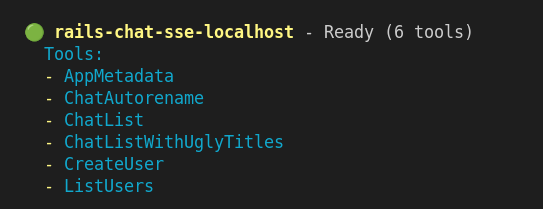

## Rails + MCP + Gemini Workshop v1.1.1

<!-- This is the master doc.
Use `just translate-workshop-to-italian` to translate to IT

CHANGELOG
01oct25 v1.1.1 [ricc] Finalized ALL chapters. Seems good now.
01oct25 v1.1.0 [ricc] Changed a few images / retook screenshots, commented out some TODOs.
01oct25 v1.0.4 [ricc] Added 2 slide decks
01oct25 v1.0.4 [ricc] Surfaced version in H1 title, and removed TODOs from the end, rephrased as quests.
29sep25 v1.0.3 [ricc] Renumbered headings to start from 0.
28sep29 v1.0.2 [ricc] Better translation, moving git clone AFTER gemini-cli
28sep25 v1.0.1 [ricc] Moved to docs/workshop/ . Added GC dep, and some nice screenshots.
27sep25 v1.0.0 [ricc] ...
-->

🇮🇹 An Italian version is available [here](WORKSHOP-it.md) 🇮🇹  (and a German [here](WORKSHOP-de.md) 🇩🇪 )

**TL;DR** In this workshop we will:

1. Install Gemini CLI
2. Download this repo, and start asking Gemini some questions.
3. Run the vanilla app, without any magic. Some functionality won't be available yet.
4. Get GCP Credits, fetch a 🔑 `GEMINI API KEY`, and put it in `.env`.
5. Restart the app, and test the LLM magic. Now the Chat responds in real-time, and creates fancy images!
6. Now let's start playing with MCP, and configure Gemini CLI to connect to your Rails app MCP! Now you can talk to your app in natural language!
7. Create your own MCP function, and test it from Gemini CLI!

**Note**. The workshop is interspersed with 🧙‍♂️ quests 🧙‍♂️. If you solve the quest in a physical workshop, tell your mentors! If you're fast, you might receive a present.
**Note**. This workshop has been created for **Devfest Modena**. You might be missing information if you're not a participant to this workshop.

Workshop material:

* 🟧 [**Workshop Slides**](https://docs.google.com/presentation/d/1W4hFU1eckLYMsdI20VyqcL-G1l11vxeeYsgBqfTMpMw/edit?slide=id.g387c805a455_1_446#slide=id.g387c805a455_1_446). A different medium to follow this workshop. Note this page is more precise and detailed, while the slides offer a synoptic high-level view.
* 🟧 [**Credits Redemption slides**](https://docs.google.com/presentation/d/1mY0BwcZERAqilVh4BaQfuX-RyayXrC4N2Pno4tzWcig/edit?slide=id.g337964b5ba0_1_193#slide=id.g337964b5ba0_1_193): here you find links to get GCP credits. You'll need them for step 3.

## 0. Prerequisites

* Have **GMail** account. This is needed to reclaim GCP credits, and to allow Gemini LLM to be used!
* `ruby` installed locally. We recommend a version manager like `rbenv`, `rvm`, `asdf` or whatever works for you.
* [optional] A **GitHub** account. This is needed only if you want to fork the repo, for advanced users.
* [optional] Install [just](https://github.com/casey/just). Without it, just look at recipes in `justfile`.

### Install/Download the code

1. `git clone https://github.com/palladius/rails8-turbo-chat.git`
2. `cp .env.dist .env`: you'll need it later.

Remember the 📂 FOLDER you're in, you'll need to launch `gemini` from this exact folder.

------

## 1. Install Gemini CLI (and get intel on the app)

<!-- **Why**. It's probably easier if users can leverage Gemini CLI from square 1. They can ask
1. What the app does
2. What was the last commit about, and so on.
-->

To **install** Gemini CLI, use either of the following commands:

```bash
# Using npx (no installation required)
npx https://github.com/google-gemini/gemini-cli
# Install globally with `npm`
npm install -g @google/gemini-cli
# Install globally with Homebrew (macOS/Linux)
brew install gemini-cli
```

More install options [here](https://github.com/google-gemini/gemini-cli).

To **start** Gemini CLI:

1. Cgange dir in the Rails app folder 📂 you downloaded before: `cd path/to/rails8-turbo-chat/`
2. Just type this: `gemini` and follow the Google authentication flow.

Let's now use Gemini CLI for some instant gratification:

1. **What is the app about?**
   1. `gemini -p "Explain the architecture of this codebase. Tell me about the Rails models and how they interact with each other"`
2. **What recent changes happened to the repo?** This is a powerful prompt to just catch up with your colleagues changes (or a recap from a change you did last night!)

<!--
```bash
$ gemini
## Copy these 4 lines and paste them onto Gemini CLI!
Give me a summary of all of the changes that went in today/yesterday, in markdown mode.
If no changes in past 2 days, take the last 3 commits instead.
Take a look at git diff and see what changes have been introduced and why. One bullet point per commit hash, please.
Dump this output in `out/git-summary.md`
```
-->


3. **What is the coding style of Riccardo or Christian?**. You can ask also human-like questions!

```bash
$ gemini
Check the latest 3 commits from:
- Christian
- Emiliano
- Riccardo
Take a look at the code in git diff and provide two info per person:
1. What coding style they have
2. What kind of code they tend to edit (frontend, backend, GCP, Docs, ..)
Dump this output in `out/people-style-summary.md`
```

Find sample answers in `docs/workshop/examples/` :)

------

## 2. Instant gratification

<!-- **Why**. This step is about getting the user happy and engaged with as little effort as possible.
-->

In this step, you install the app and get it to run

1. `cd rubyllm_chat_app/`
2. Install ruby and bundler
3. Run `bundle install`
4. Run `bundle exec rails db:setup`
1. [ricc] `bundle exec rails server` to run the server in port 8080
1. Navigate your browser to http://localhost:8080/ . You should see a page like below:

1. Click on "Sign up"
2. Click "Sign up" and add:
   1. Your **Email**, **Name**, **Password** and repeat it in **Password Confirmation**


1. You're done! Now we can  to create your first chat


2. Click "Start New Chat".
   1. oh oh - this is broken! We need a Gemini API Key.


<!--
TODO(Christian): `rails s` and DB set up.
-->

**Note**. This should work with everything except the images and chat, so maybe we should use some sort of DB generation (`rake db:seed` ?) to generate a fake chat. This will be a good way to show the app working without having to set up the API key - yet: baby steps.


### 2B. Ask Gemini CLI about the DB

```
Now find the dev sqlite file and show me the tables.
Show me all the schema and create a DATABASE_INFO.md which contains:
1. The schema you've found.
2. A Mermaid graph of all the tables and how they interconnect (foreign keys) in visual way.
Embed all in the markdown file. Color in red the tables matching the models in app/models/ and
in GRAY everything else.
```

See a possible answer under `examples/DATABASE_INFO.md`


* Now it's **your** turn! You can ask ANY question to Gemini CLI - you can get more details on those tables and compare results from the bare DB view with the ORM queries (like `echo Chat.last | rails console`)


------

## 3. Get Gemini API Key and start creating images!

### 3a. Reclaim GCP credits..


<!-- **Why**. In this step the user will do two things:
    1. retrieve Cloud credits to use Gemini (boring), but also
    2. Use those credits
-->

* retrieve credits by clicking here: https://trygcp.dev/e/devfest-maudna-25 logging in with your *personal* Google account.
* Follow the link to get `5$` in credits. They will suffice for the workshop.
* Go to https://aistudio.google.com/apikey and generate a GEMINI API KEY. Note it locally in your `.env`, under `GEMINI_API_KEY`
* If you're confused, check these [step-by-step slides](https://docs.google.com/presentation/d/1mY0BwcZERAqilVh4BaQfuX-RyayXrC4N2Pno4tzWcig/edit?) the team has created for you.

### 3b. .. and use Gemini FTW!

Now that you've done the boring part, ready to generate your first images?

* First thing, check that Gemini works within the app. The easiest way is to call `just test-gemini`
* restart the app.
* Ensure the Gemini API Key works
  * Maybe ensure that a missing API Key throws a visible warning on top?
  * If you can see the error, it means you did something wrong. If the error has disappeared, you're good!

* Create a new chat.
* Ask a question...
  * Observe the magic: an image is generated and a synopsis of the chat is also generated
  * **Before** (note I didn't screenshot in time and title/description had already changed..)

  * ... and **after** 5 seconds!


### 3c change image generation


🧙‍♂️ **Quest** 🧙‍♂️ Did you notice all images come out with a yellow heart and a ruby? Looks like there might be an easter egg in the code.

* Find the part of the code where it adds these 2 'filigrees' (or 'watermarks') to the image
* Change it to something local to your geography, eg (for Modena, to include the face of Pavarotti).
* Test the new generation (possibly reloading the app)
* Show to a proctor to get your prize.

------

## 4. Test existing MCP with MCP Inspector

<!--
Here we Show we have existing MCP already pre-built
-->

1. Let's troubleshoot with `npx @modelcontextprotocol/inspector` (the best MCP client debugging tool to the author's knowledge - file issue if you think he's wrong).
2. Click on the link from CLI (note the `MCP_PROXY_AUTH_TOKEN`!), something like: `http://localhost:6274/?MCP_PROXY_AUTH_TOKEN=mys3cr3tt0k3n`
3. Set up:
   1. Transport type: **SSE**
   2. URL: `http://localhost:8080/mcp/sse`
4. Click **connect**.
5. If it works, click on **Tools**
6. Click List Tools.
7. You should see this: 
8. Click on one tool to execute, for instance `Chat List`. Enjoy an output like this! Note the MCP Server is calling ActiveRecord here!


### 4.A - test the same on your IDE

If you have `vscode`, IntelliJ, Claude Code, you can now test MCP. Please check your agent configuration on how to add the MCP.

#### Add local MCP to Gemini CLI


* Use `gemini mcp` to add our MCP dynamically:
  * `gemini mcp add --transport sse local-rails8-turbo-chat-sse http://localhost:8080/mcp/sse`
  * This will configure gemini to have this MCP available.
* **ReStart** `gemini` (double CTRL-C). MCP are loaded at startup, so don't forget!
* Type `/mcp` to ensure this is done correctly. You should see something like this (note the green button beside the MCP server name):




If you're using other tools (vscode, copilot, Claude Code), check the documentation for adding them.
Usually you need to add a JSON like this:

```json
{
  // ..Other options here..
  "mcpServers": {
    // ..Other MCP servers here..
    "rails-chat-sse-localhost": {
      "type": "sse",
      "url": "http://localhost:8080/mcp/sse"
    }
  }
}
```

To your local file (eg `.vscode/settings.json` for Visual Studio code).

Now you can interact with Gemini CLI (or Copilot, Claude, ..) and start interacting with your application with questions like:

*  `Retrieve a list of chats: Any chat containing italian food?`
*  `Add a user created "test-workshop@example.com" and password "PincoPallinoJoe" and name "Test for Workshop"`


   *  `Now list users` (which should also surface the new user)

* Ask `Use MCP to Autorename all chats`. This should magically update chat titles for all wrongly named chats.

------

## 5. Add your own MCP

**Ideas**. Ok, time to code something yourself! You can be creative, or get some of these ideas:

* `what_time_is_it`: Add a "What date / time is it".  function.
* `where_am_ai`: Call an external API to fetch local weather or closest city.
* *ActiveRecord magic*: Some ActiveRecord magic to count relationships and give a statistics (how many users have created how many chats).
  * Maybe something which plays well with ActiveStorage too? Maybe somethign which helps troubleshooting and fixing [this issue](https://github.com/palladius/rails8-turbo-chat/issues/24)?

<!--
* TODO(Emiliano): any ideas what we can add here?
 -->

**Execution**.

You have an idea of what to code? Great!


Now:
1. Add your function to `app/tools/` ([folder](https://github.com/palladius/rails8-turbo-chat/tree/main/rubyllm_chat_app/app/tools)).
2. Remember to subclass from `ActionTool::Base`. More details in https://github.com/yjacquin/fast-mcp
3. Once it works, load the `rails c` and test that the code works as intended first.
4. Then, reload the `rails s`; this ensures your app has the new function!
5. Now time to test it with your MCP Tools! First use Gemini CLI (reload this too) via `/mcp` to check the new feature has appeared.
6. Test the function by asking a natural language question that matches the function description (eg "What time is it / Where am I / ...").


------


## 6. [optional] Persist images on GCS 🧙‍♂️

OMG, you got here faster than we could document it! Time for a challenge!

🧙‍♂️ Learn to persist your image on Google Cloud Storage. Official Active Storage + GCS docs are [here](https://guides.rubyonrails.org/active_storage_overview.html#google-cloud-storage-service).
<!--
This is a game changer, since a push to the cloud will persist images across computers and across local vs remote. But it's hard to setup.
-->


## 7. [optional] Try `docker compose`

🧙‍♂️  Did you know Cloud run now supports docker-compose in alpha? 🧙‍♂️

First, try this first locally:

```bash
cd rubyllm_chat_app/
docker-compose up
docker compose run web todo # TODO(Emiliano) some command like rake db:seed or some different test
```

Second, once you get it to work, try this in the Cloud:

```bash
gcloud alpha run compose --help
```

🧙‍♂️ Let us know if you make it! 🧙‍♂️


<!-- TODO(Emiliano): complete this -->

Tip: Riccardo created a working version here: https://github.com/palladius/rails8-composer-sample/blob/main/README.md follow the symlink bread crumbles to the solution.

Tip: Alpha User Guide document is [here](https://docs.google.com/document/d/1UJrkn6wnzoHTQjenERhKfvOWPUahBydaWUNF-84B4c8/view?resourcekey=0-qixytbA9n5irnaH3QDyL6g&tab=t.0#heading=h.74iuc6663cso).

## 8. [optional] Build and launch to Cloud Run via `docker compose alpha`

<!-- once GCS is configured, and maybe Emiliano can help, the rest is a breeze, at least for Riccardo
TODO(ricc/Emiliano) -->

🧙‍♂️  Configure cloud Build and push to Cloud run.  🧙‍♂️

The idea is to build a working CI/CD pipeline so every subsequent commit/push to YOUR repo.

1. Fork this repo to https://github.com/YOUR_USER_NAME/rails8-turbo-chat/
2. Adapt `cloudbuild.yaml` with your own project id and parameters.
3. Set up ServiceAccount for it. Check `iac/` for goodies and prebaked code!

Tip: a working `cloudbuild.yaml` is in the base folder and works for the author. Same with `iac/` for all GCP setup! You just need to tweak and change a few things. Something Gemini CLI can help you with!
