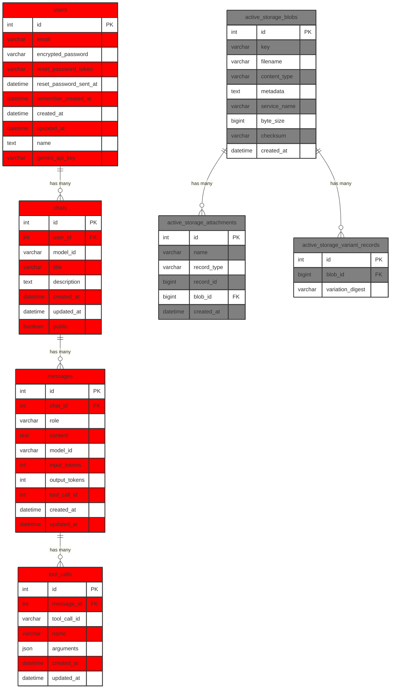

# Database Schema

```sql
CREATE TABLE IF NOT EXISTS "schema_migrations" ("version" varchar NOT NULL PRIMARY KEY);
CREATE TABLE IF NOT EXISTS "ar_internal_metadata" ("key" varchar NOT NULL PRIMARY KEY, "value" varchar, "created_at" datetime(6) NOT NULL, "updated_at" datetime(6) NOT NULL);
CREATE TABLE sqlite_sequence(name,seq);
CREATE TABLE IF NOT EXISTS "active_storage_blobs" ("id" integer PRIMARY KEY AUTOINCREMENT NOT NULL, "key" varchar NOT NULL, "filename" varchar NOT NULL, "content_type" varchar, "metadata" text, "service_name" varchar NOT NULL, "byte_size" bigint NOT NULL, "checksum" varchar, "created_at" datetime(6) NOT NULL);
CREATE TABLE IF NOT EXISTS "users" ("id" integer PRIMARY KEY AUTOINCREMENT NOT NULL, "email" varchar DEFAULT '' NOT NULL, "encrypted_password" varchar DEFAULT '' NOT NULL, "reset_password_token" varchar, "reset_password_sent_at" datetime(6), "remember_created_at" datetime(6), "created_at" datetime(6) NOT NULL, "updated_at" datetime(6) NOT NULL, "name" text, "gemini_api_key" varchar);
CREATE TABLE IF NOT EXISTS "active_storage_attachments" ("id" integer PRIMARY KEY AUTOINCREMENT NOT NULL, "name" varchar NOT NULL, "record_type" varchar NOT NULL, "record_id" bigint NOT NULL, "blob_id" bigint NOT NULL, "created_at" datetime(6) NOT NULL, CONSTRAINT "fk_rails_c3b3935057"
FOREIGN KEY ("blob_id")
  REFERENCES "active_storage_blobs" ("id")
);
CREATE TABLE IF NOT EXISTS "active_storage_variant_records" ("id" integer PRIMARY KEY AUTOINCREMENT NOT NULL, "blob_id" bigint NOT NULL, "variation_digest" varchar NOT NULL, CONSTRAINT "fk_rails_993965df05"
FOREIGN KEY ("blob_id")
  REFERENCES "active_storage_blobs" ("id")
);
CREATE TABLE IF NOT EXISTS "chats" ("id" integer PRIMARY KEY AUTOINCREMENT NOT NULL, "user_id" integer NOT NULL, "model_id" varchar, "title" varchar, "description" text, "created_at" datetime(6) NOT NULL, "updated_at" datetime(6) NOT NULL, "public" boolean DEFAULT 0 NOT NULL, CONSTRAINT "fk_rails_e555f43151"
FOREIGN KEY ("user_id")
  REFERENCES "users" ("id")
);
CREATE TABLE IF NOT EXISTS "messages" ("id" integer PRIMARY KEY AUTOINCREMENT NOT NULL, "chat_id" integer NOT NULL, "role" varchar, "content" text, "model_id" varchar, "input_tokens" integer, "output_tokens" integer, "tool_call_id" integer, "created_at" datetime(6) NOT NULL, "updated_at" datetime(6) NOT NULL, CONSTRAINT "fk_rails_0f670de7ba"
FOREIGN KEY ("chat_id")
  REFERENCES "chats" ("id")
);
CREATE TABLE IF NOT EXISTS "tool_calls" ("id" integer PRIMARY KEY AUTOINCREMENT NOT NULL, "message_id" integer NOT NULL, "tool_call_id" varchar NOT NULL, "name" varchar NOT NULL, "arguments" json DEFAULT '{}', "created_at" datetime(6) NOT NULL, "updated_at" datetime(6) NOT NULL, CONSTRAINT "fk_rails_9c8daee481"
FOREIGN KEY ("message_id")
  REFERENCES "messages" ("id")
);
```

# Database Diagram


