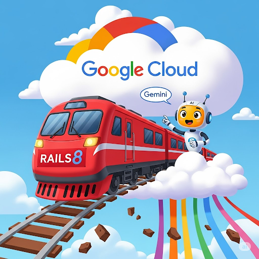
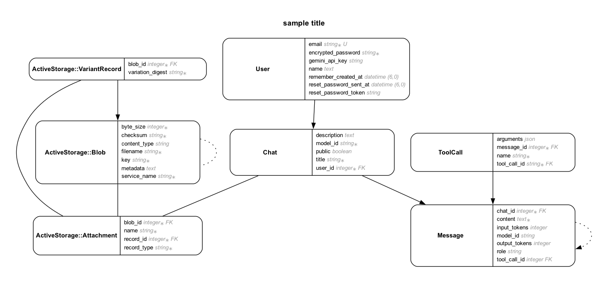

# Rails8 Turbo Chat

A responsive Rails chat application with `ruby_llm` integration. This application demonstrates a modern Rails 8 application using Turbo Streams for real-time updates and integrating with large language models.



## Features

- Real-time chat interface with Turbo Streams for instant message updates
- Integration with Google Gemini AI models through the `ruby_llm` gem
- User authentication with Devise
- Chat persistence in PostgreSQL database
- Automatic chat title generation using AI
- Image generation for chats using Google Imagen
- "I'm feeling lucky" feature that generates title, description, and image in one click
- Public chat sharing functionality
- Model Context Protocol (MCP) server for AI agent integration
- Responsive design with Tailwind CSS
- Google Cloud Storage integration for image uploads
- Background job processing with Solid Queue

## Prerequisites

- Ruby 3.4.5
- SQLite3 (for development)
- Google Gemini API Key
- PostgreSQL (for production)
- Google Cloud account (for production deployment)

## Quick Start

### Environment Variables

The application requires several environment variables to function properly. Copy `.env.dist` to `.env` and configure the following:

- `GEMINI_API_KEY` - Your Google Gemini API key
- `PROJECT_ID` - Your Google Cloud project ID
- `GCS_BUCKET` - Google Cloud Storage bucket name
- `GCS_CREDENTIALS_JSON` - Google Cloud service account credentials (JSON format)

### Development Setup

1. Clone the repository:
```bash
git clone https://github.com/palladius/rails8-turbo-chat.git
cd rails8-turbo-chat/project
```

2. Install dependencies:
```bash
bundle install
```

3. Set up the database:
```bash
bin/rails db:prepare
```

4. Create a `.env` file based on `.env.dist` and add your API keys:
```bash
cp .env.dist .env
# Edit .env to add your GEMINI_API_KEY and other required variables
```

5. Now you have two options to run this project:
statically compile frontend assets and run the backend server with
```bash
bin/rails assets:precompile
bin/dev
```
or, run two separate processes, one for the frontend assets reloading:
```bash
bin/rails tailwindcss:watch
```
the other one, in a separate shell, for the backend server:
```bash
bin/dev
```

This will start the server on `http://localhost:3000`

### Production Setup

For production deployment, you'll need to:

1. Set up a PostgreSQL database
2. Configure Google Cloud Storage for image uploads
3. In addition to the already set up development variables, you should configure:
   - `PROJECT_ID` - Your Google Cloud project ID
   - `DATABASE_URL_PROD` - PostgreSQL connection string
   - `RAILS_MASTER_KEY` - Your Rails master key for encrypted credentials

## Deployment

### Cloud Run Deployment

The application is designed to be deployed to Google Cloud Run. The deployment process involves:

1. Building a Docker image:
   ```bash
   docker build -t rails8-turbo-chat .
   ```

2. Pushing the image to Google Container Registry:
   ```bash
   docker tag rails8-turbo-chat gcr.io/YOUR_PROJECT_ID/rails8-turbo-chat
   docker push gcr.io/YOUR_PROJECT_ID/rails8-turbo-chat
   ```

3. Deploying to Cloud Run:
   ```bash
   gcloud run deploy rails8-turbo-chat \
     --image gcr.io/YOUR_PROJECT_ID/rails8-turbo-chat \
     --platform managed \
     --region YOUR_REGION \
     --set-env-vars="GEMINI_API_KEY=YOUR_API_KEY,PROJECT_ID=YOUR_PROJECT_ID,GCS_BUCKET=YOUR_BUCKET" \
     --allow-unauthenticated
   ```

### Cloud Build

The project includes a `cloudbuild.yaml` file for automated builds using Google Cloud Build.

## Model Context Protocol (MCP) Server

This application includes a built-in Model Context Protocol server that allows AI agents to interact with the application's data and functionality.

### MCP Endpoints

- SSE endpoint: `/mcp/sse`
- You can test with the MCP inspector: `npx @modelcontextprotocol/inspector`

### Available MCP Tools

- `AppMetadata` - Returns application metadata
- `ListUsers` - Lists all users
- `CreateUser` - Creates a new user
- `ChatList` - Lists all chats
- `ChatListWithUglyTitles` - Lists chats with default titles

### Available MCP Resources

- `SampleResource` - User data resource
- `RiccardoEasterEgg` - Sample easter egg resource

## Database Schema

The application uses the following models:

- **User** - Represents application users with Devise authentication
- **Chat** - Represents conversation threads belonging to users
- **Message** - Represents individual messages within chats
- **ToolCall** - Represents tool calls made by the AI assistant



## Background Jobs

The application uses background jobs for long-running operations:

- `ChatStreamJob` - Handles chat message streaming
- `GenerateChatImageJob` - Generates images for chats
- `ImFeelingLuckyJob` - Generates title, description, and image for chats
- `AutotitleChatsJob` - Automatically generates titles for chats

## Cloud Scheduler Integration

The application supports scheduled jobs via Google Cloud Scheduler:

1. Set the `CLOUD_SCHEDULER_SECRET` environment variable
2. Configure Cloud Scheduler to call `/jobs/autotitle_chats` with the secret in the `X-Cloud-Scheduler-Secret` header

Local testing:
```bash
bin/cloud-scheduler-local-test.sh
```

## Development Commands

The project includes a `justfile` with useful commands:

- `just dev` - Start development server
- `just docker-build` - Build Docker image
- `just test` - Run tests
- `just mcp-inspector` - Start MCP inspector
- `just db-destroy` - Reset database

## License

This project is licensed under the MIT License.

## Author

Created by Riccardo Carlesso - [LinkedIn](https://www.linkedin.com/in/riccardocarlesso/)

## Links

- 🐙 [GitHub Repository](https://github.com/palladius/rails8-turbo-chat)

